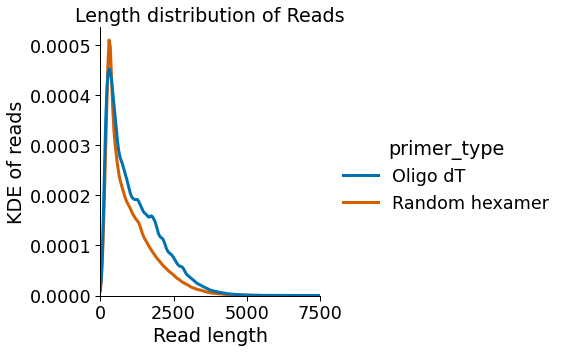
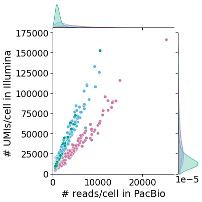
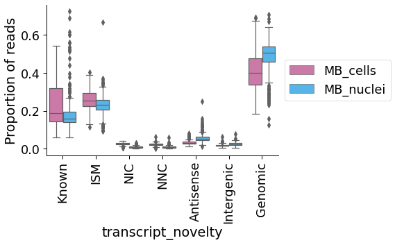
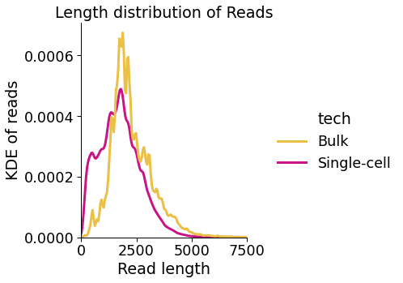

# Figure 1

* CCS reads were generated from raw PacBio reads usin the CCS softare from the SMRT analysis software suite (parameters: --skip-polish --min-length=10 --min-passes=3 --min-rq=0.9 --min-snr=2.5) 
* The Split-seq adapters were identified and removed using Lima (v2.0.0) (parameters: --ccs --min-score 0  --min-end-score 0 --min-signal-increase 0 --min-score-lead 0) 
* Full-length non-chimeric reads were generated with IsoSeq3's Refine (v3.4.0)
* Reads were demultiplexed for their Split-seq barcodes using a custom script (https://github.com/fairliereese/pacbio-splitpipe)
* Demultiplexed reads were filtered for those where the same combination of barcodes were also detected in the correspoding short-read experiment
* Reads were mapped to the mm10 reference genome using Minimap2 (v2.17-r94) (-ax splice:hq -uf --MD)
* Long-read sequencing artifacts were corrected with TranscriptClean (--canonOnly --primaryOnly)
* Reads were annotated to their transcripts of origin using TALON (https://github.com/mortazavilab/TALON/tree/cb_tag) (--cb) and the GENCODE vM21 annotation. Each cell is its own dataset in the output TALON database.
* NIC and NCC transcripts were filtered for those that were seen in 2 or more cells


```python
import sys
import os
import scanpy as sc
import pandas as pd

p = os.path.dirname(os.getcwd())
sys.path.append(p)

from scripts.utils import *
from scripts.plotting import *
```


```python
# read in the data relevant for this figure
def get_sc_data():
    fname = '../processing/talon/sc_talon_read_annot.tsv'

    df = pd.read_csv(fname, sep='\t')
    df = add_read_annot_metadata(df)
    
    return df

def get_sc_adata():
    fname = '../processing/scanpy/sc_gene.h5ad'
    adata = sc.read(fname)
    
    return adata
    
def get_sc_whitelist():
    fname = '../processing/talon/sc_whitelist.csv'
    whitelist = read_whitelist(fname)
    
    return whitelist

def get_sc_bulk_data():
    fname = '../processing/talon/bulk_sc_talon_read_annot.tsv'

    df = pd.read_csv(fname, sep='\t')
    df = add_read_annot_metadata(df, bulk=True)
    
    return df
```

### Panel 1B


```python
df = get_sc_data()
opref = 'figures/dt_v_randhex'
c_dict, order = get_priming_colors()
plot_read_len_kde(df, 'primer_type', c_dict, order, opref)
```


    

    


### Panel 1C


```python
df = get_sc_data()
opref = 'figures/dt_v_randhex'
c_dict, order = get_priming_colors()
plot_reads_per_cell_nov(df, 'primer_type', c_dict, order, opref)
```


    

    


### Panel 1D


```python
opref = 'figures/sample'
adata = get_sc_adata()
c_dict, order = get_sample_colors()
plot_short_long_det(adata.obs, c_dict, order, opref, 
                    xlim=7000, ylim=11000, how='gene')
```


    

    


### Panel 1E


```python
opref = 'figures/sample'
adata = get_sc_adata()
c_dict, order = get_sample_colors()
plot_short_long_det(adata.obs, c_dict, order, opref, 
                    xlim=27000, ylim=175000, how='read')
```


    

    


### Panel 1F


```python
opref = 'figures/cells_v_nuclei'
df = get_sc_data()

# remove genomic reads and limit to only MB cells and nuclei
df = df.loc[df['sample'] != 'MT_nuclei']
df = df[df.transcript_novelty!='Genomic']

c_dict, order = get_sample_colors(samples=['MB_cells', 'MB_nuclei'])
plot_read_len_kde(df, 'sample', c_dict, order, opref)
```


    

    


### Panel 1G


```python
df = get_sc_data()

# limit to only MB cells and nuclei
df = df.loc[df['sample'] != 'MT_nuclei']
c_dict, order = get_sample_colors(samples=['MB_cells', 'MB_nuclei'])

plot_reads_per_cell_nov(df, 'sample', c_dict, order, opref)
```


    

    


### Panel 1H


```python
opref = 'figures/bulk_vs_sc'
df = get_sc_bulk_data()
c_dict, order = get_tech_colors()
plot_read_len_kde(df, 'tech', c_dict, order, opref, common_norm=False)
```

    /Users/fairliereese/miniconda3/lib/python3.7/site-packages/IPython/core/interactiveshell.py:3347: DtypeWarning: Columns (18) have mixed types.Specify dtype option on import or set low_memory=False.
      if (await self.run_code(code, result,  async_=asy)):


    

    


### Panel 1I


```python
opref = 'figures/bulk'
df = get_sc_bulk_data()
c_dict, order = get_talon_nov_colors()
d = df.loc[df.experiment == 'bulk', 'dataset'].unique().tolist()
plot_read_novelty(df, opref, c_dict, order, title='Bulk', \
                  datasets=d, ylim=7200000)
```

      transcript_novelty   counts
    0          Antisense   259540
    1            Genomic   448898
    2                ISM  1102134
    3         Intergenic    40109
    4              Known  6654958
    5                NIC   531944
    6                NNC   284313


    

    


### Panel 1J


```python
opref = 'figures/sc'
df = get_sc_bulk_data()
c_dict, order = get_talon_nov_colors()
d = df.loc[df.experiment == 'sc', 'dataset'].unique().tolist()
plot_read_novelty(df, opref, c_dict, order, title='Single cell/nucleus', \
                  datasets=d)
```

      transcript_novelty  counts
    0          Antisense   70402
    1            Genomic  709033
    2                ISM  386720
    3         Intergenic   25641
    4              Known  317621
    5                NIC   20503
    6                NNC   15492


    

    


### Panel 1K


```python
opref = 'figures/sc_filtered'
df = get_sc_data()
whitelist = get_sc_whitelist()
c_dict, order = get_talon_nov_colors()
plot_transcript_novelty(df, opref, c_dict, order, title='Filtered',
                        whitelist=whitelist, ylim=27000)
```

      transcript_novelty  counts
    0          Antisense     927
    1                ISM   16207
    2         Intergenic    1042
    3              Known   22279
    4                NIC     393
    5                NNC     134


    

    


    <Figure size 432x288 with 0 Axes>

