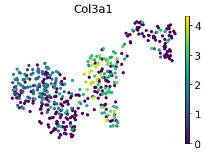

# Figure 2

#### For the long-read bulk and single-cell data
* The bulk long-read TALON database was obtained using the steps in [figure_1](https://github.com/fairliereese/2021_c2c12/tree/master/figure_1).
* TALON was run for the single-cell long reads using the [cb_tag](https://github.com/mortazavilab/TALON/tree/cb_tag) branch of TALON (--cb) on the database from the preceding step using the reads to get a unified set of genes and transcripts that were present in the bulk or the single-cell data

#### For the long-read single-cell data
* The data was processed using the steps in [figure_1](https://github.com/fairliereese/2021_c2c12/tree/master/figure_1).
* The short-read single-cell cluster identities and other characteristics were assigned by merging the 464 cells in short and long-read by barcode

#### For the short-read single-cell data 
* TODO @Liz

## Figures made in Python

```python
import sys
import os
import pandas as pd 
import scanpy as sc
import seaborn as sns

p = os.path.dirname(os.getcwd())
sys.path.append(p)

from scripts.utils import *
from scripts.plotting import *
```


```python
# read in the data relevant for this figure

# output from the bulk+sc TALON run
def get_sc_data():
    fname = '../processing/talon/sc_talon_abundance_filtered.tsv'
    df = pd.read_csv(fname, sep='\t')    
    df['experiment'] = 'bulk'
    return df

# output from the bulk+sc TALON run
def get_bulk_data():
    fname = '../processing/talon/bulk_talon_abundance_filtered.tsv'
    df = pd.read_csv(fname, sep='\t')
    
    # remove SIRVs and ERCCs
    df = df.loc[~df.annot_gene_id.str.contains('SIRV')]
    df = df.loc[~df.annot_gene_id.str.contains('ERCC')]
    
    df['experiment'] = 'sc'
    return df

# output from transforming the unfiltered TALON abundance matrix into 
# a scanpy AnnData object
def get_sc_adata():
    fname = '../processing/scanpy/sc_gene.h5ad'
    adata = sc.read(fname)
    
    return adata
```

### Panel 2A


```python
opref = 'figures/bulk_vs_sc'
bulk = get_bulk_data()
sc = get_sc_data()
gtf = '/Users/fairliereese/Documents/programming/mortazavi_lab/ref/gencode.vM21/gencode.vM21.annotation.gtf'
```


```python
_, _ = plot_upset_plot(bulk, sc, opref, gtf, kind='gene', novelty='Known')
```


    

    


```python
plot_detection_venn(bulk, sc, opref, gene_nov='Known', \
                    sample='MB', cell_part='cell')
```


    

    


```python
plot_detection_venn(bulk, sc, opref, gene_nov='Known', \
                    sample='MB', cell_part='nucleus')
```


    

    


```python
plot_detection_venn(bulk, sc, opref, gene_nov='Known', \
                    sample='MT', cell_part='nucleus')
```


    

    


### Panel 2B


```python
_, _ = plot_upset_plot(bulk, sc, opref, gtf, kind='transcript', novelty='Known')
```


    

    


```python
plot_detection_venn(bulk, sc, opref, transcript_nov='Known', \
                    sample='MB', cell_part='cell')
```


    

    


```python
plot_detection_venn(bulk, sc, opref, transcript_nov='Known', \
                    sample='MB', cell_part='nucleus')
```


    

    


```python
plot_detection_venn(bulk, sc, opref, transcript_nov='Known', \
                    sample='MT', cell_part='nucleus')
```


    

    


### Panel 2D


```python
adata = get_sc_adata()
opref = 'figures/gene'
sns.set_context('paper', font_scale=2)    
```

    Transforming to str index.


```python
sc.pl.umap(adata, color='leiden', frameon=False, size=120, show=False)
plt.savefig('{}_umap_leiden.pdf'.format(opref), dpi=300, bbox_inches='tight')
```

    /Users/fairliereese/miniconda3/lib/python3.7/site-packages/anndata/_core/anndata.py:1154: FutureWarning: is_categorical is deprecated and will be removed in a future version.  Use is_categorical_dtype instead
      if is_string_dtype(df[key]) and not is_categorical(df[key])


    

    


### Panel 2E


```python
# visualize the UMAP by different variables
sc.pl.umap(adata, color='short_leiden', frameon=False, size=120, show=False)
plt.savefig('{}_umap_short_leiden.pdf'.format(opref), dpi=300, bbox_inches='tight')
```


    

    


### Panel 2F


```python
genes = ['Mki67', 'Hmga2', 'Pax7', 'Igfbp5',
         'Col3a1', 'Col1a1', 'Myog', 'Mybph', 
         'Myh3', 'Rbm24']
for g in genes:
    sc.pl.umap(adata, color=g, frameon=False, size=120)
    plt.savefig('{}_umap_{}.pdf'.format(opref, g), dpi=300, bbox_inches='tight')
```


    

  


    
    

  


    
    

    


    
    


    

    
    

    
 

    
    
## Figures made in R

```R
library(Seurat)
library(tidyverse)
options(stringsAsFactors = FALSE)

source('../scripts/plotting.R')
```


```R
get_lr_sc_data <- function() {
    seurat_obj = readRDS('../processing/scanpy/sc_gene.rds')
    return(seurat_obj)
}

get_sr_sc_data <- function() {
    load('../processing/seurat/sc_1k.rda')
    seurat_obj <- mb_mt_1k
    return(seurat_obj)
}
```

### Panel 2C


```R
opref = 'figures/'
seurat_obj = get_sr_sc_data()
colors = get_short_clust_colors()

p = DimPlot(
  object = seurat_obj,pt.size = 2.2,
  group.by = 'final_clusters_ordered',
  label = F,label.size = 6,
  repel = TRUE)  + NoLegend() + NoAxes()+ scale_color_manual(values = colors)

pdf(file = paste0(opref, "shortreads_464cells_UMAP_dark2.pdf"), width = 5.5, height = 5)
dev.off()
p
```


    

    


```R
colors = get_sample_colors()
p = ggplot(seurat_obj@meta.data, aes(x=final_clusters_ordered, fill=SampleType)) + 
    geom_bar(position = "fill")  + 
    scale_fill_manual(values=colors) + 
    coord_flip()
fname = 'figures/shortreads_464cells_barplot.pdf'
pdf(file = fname,
    width = 3.2,
    height = 4.5)
dev.off()

p
```


    

    


### Panel 2D cluster proportions


```R
opref = 'figures/'
seurat_obj = get_lr_sc_data()
colors = get_sample_colors()
p = plot_clust_prop(seurat_obj, 'sample', colors, opref)
p
```


    

    


### Panel 2E cluster proportions


```R
opref = 'figures/'
seurat_obj = get_lr_sc_data()
colors = get_long_clust_colors()
p = plot_short_clust_prop(seurat_obj, 'leiden', colors, opref)
p
```


    

    

