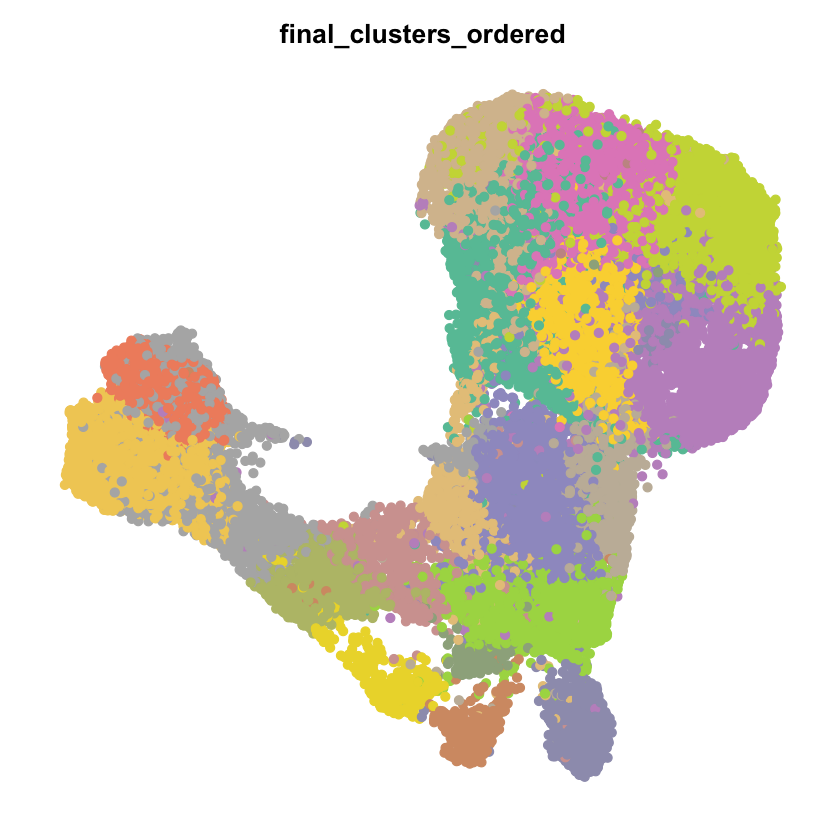
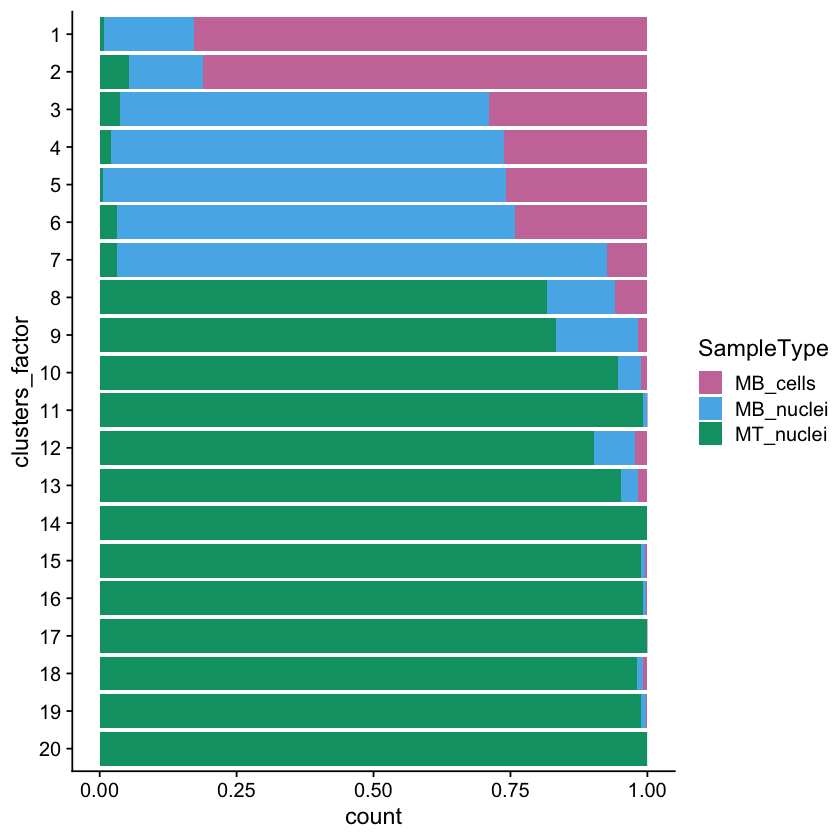
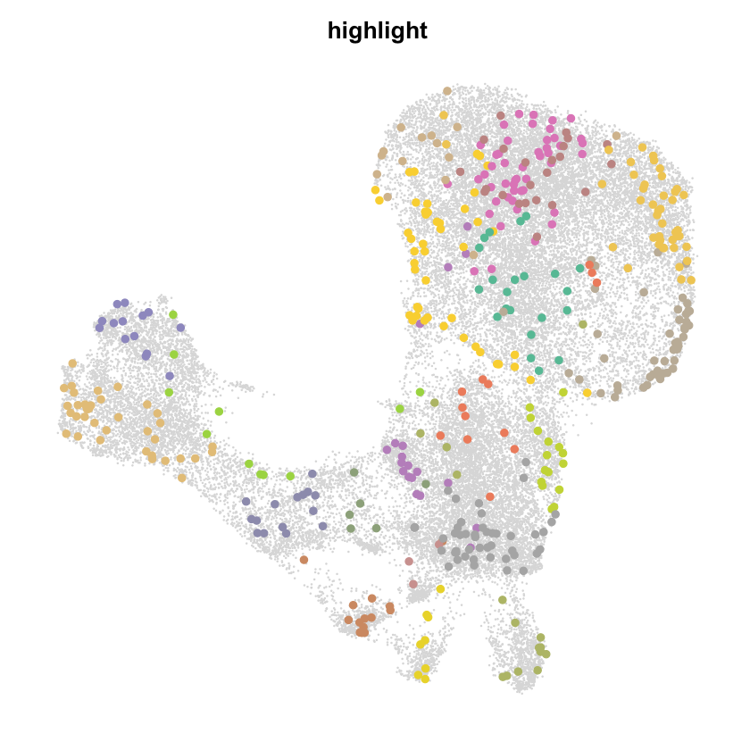
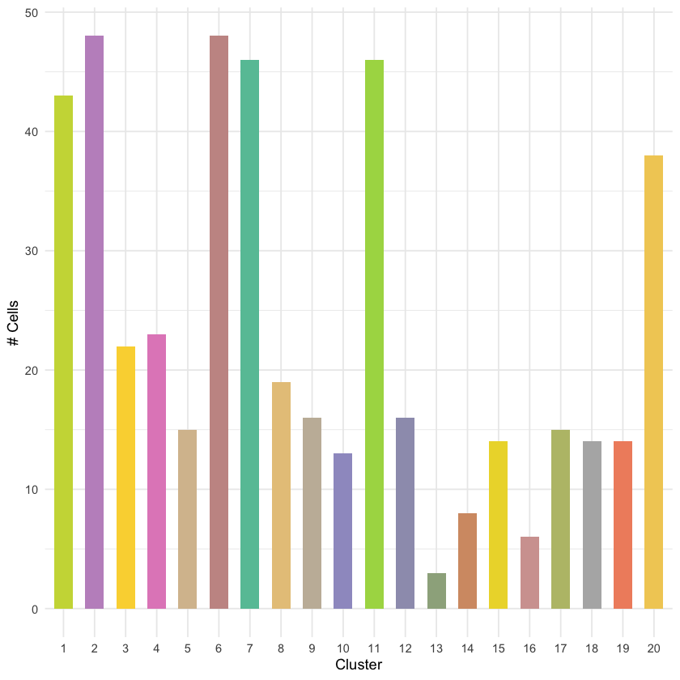
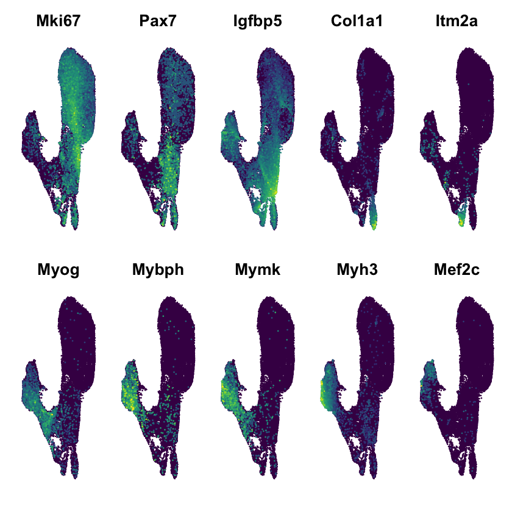
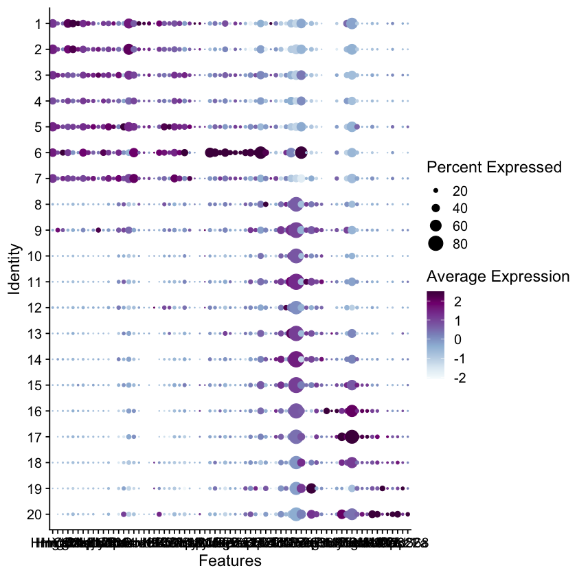

# Figure 3

#### For the 40k cell sublibraries 
* TODO @Liz

#### For the 1k cell sublibrary
* TODO @Liz

```R
library(Seurat)
library(tidyverse)
library(viridis)
library(RColorBrewer)
options(stringsAsFactors = FALSE)

source('../scripts/plotting.R')
```


```R
# output from Seurat
get_40k_sc_data <- function() {
    load('../processing/seurat/sc_40k.rda')
    seurat_obj <- mb_mt
    return(seurat_obj)
}

# output from Seurat
get_1k_sc_data <- function() {
    load('../processing/seurat/sc_1k.rda')
    seurat_obj <- mb_mt_1k
    return(seurat_obj)
}
```

### Panel 3A


```R
seurat_obj = get_40k_sc_data()
colors = get_40k_clust_colors()
p = DimPlot(
  object = seurat_obj,pt.size = 2.2,
  group.by = 'final_clusters_ordered',
  label = F,label.size = 6,
  repel = TRUE)  + NoLegend() + NoAxes()+ scale_color_manual(values = colors)

fname = 'figures/shortreads_40k_clusters.pdf'
pdf(fname, width = 5.5, height = 5)
p
dev.off()
p
```


    

    


```R
colors = get_sample_colors()


cluster_levels <- rev(as.numeric(levels(seurat_obj$final_clusters_ordered)))
seurat_obj$clusters_factor <- factor(
    seurat_obj$final_clusters_ordered,
    cluster_levels
)

p = ggplot(seurat_obj@meta.data, aes(x=clusters_factor, fill=SampleType)) + 
    geom_bar(position = "fill")  + 
    scale_fill_manual(values=colors) + 
    coord_flip()
fname = 'figures/shortreads_40k_barplot.pdf'
pdf(file = fname,
    width = 3.2,
    height = 4.5)
p
dev.off()
p
```


    

    


### Panel 3B


```R
seurat_1k = get_1k_sc_data()
seurat_40k = get_40k_sc_data()

pb_ids_vel_464_plot = paste0("single_cells_barcoded_headAligned_sorted_ZE3GQ:",as.character(colnames(seurat_1k)),"_1kx")

c1 <- WhichCells(seurat_40k, idents = "1")
c1_filt = c1[c1 %in% pb_ids_vel_464_plot]
c2 <- WhichCells(seurat_40k, idents ="2")
c2_filt = c2[c2 %in% pb_ids_vel_464_plot]
c3 <- WhichCells(seurat_40k, idents ="3")
c3_filt = c3[c3 %in% pb_ids_vel_464_plot]
c4 <- WhichCells(seurat_40k, idents ="4")
c4_filt = c4[c4 %in% pb_ids_vel_464_plot]
c5 <- WhichCells(seurat_40k, idents ="5")
c5_filt = c5[c5 %in% pb_ids_vel_464_plot]
c6 <- WhichCells(seurat_40k, idents ="6")
c6_filt = c6[c6 %in% pb_ids_vel_464_plot]
c7 <- WhichCells(seurat_40k, idents ="7")
c7_filt = c7[c7 %in% pb_ids_vel_464_plot]
c8 <- WhichCells(seurat_40k, idents ="8")
c8_filt = c8[c8 %in% pb_ids_vel_464_plot]
c9 <- WhichCells(seurat_40k, idents ="9")
c9_filt = c9[c9 %in% pb_ids_vel_464_plot]
c10 <- WhichCells(seurat_40k, idents ="10")
c10_filt = c10[c10 %in% pb_ids_vel_464_plot]
c11 <- WhichCells(seurat_40k, idents ="11")
c11_filt = c11[c11 %in% pb_ids_vel_464_plot]
c12 <- WhichCells(seurat_40k, idents ="12")
c12_filt = c12[c12 %in% pb_ids_vel_464_plot]
c13 <- WhichCells(seurat_40k, idents ="13")
c13_filt = c13[c13 %in% pb_ids_vel_464_plot]
c14 <- WhichCells(seurat_40k, idents ="14")
c14_filt = c14[c14 %in% pb_ids_vel_464_plot]
c15 <- WhichCells(seurat_40k, idents ="15")
c15_filt = c15[c15 %in% pb_ids_vel_464_plot]
c16 <- WhichCells(seurat_40k, idents ="16")
c16_filt = c16[c16 %in% pb_ids_vel_464_plot]
c17 <- WhichCells(seurat_40k, idents ="17")
c17_filt = c17[c17 %in% pb_ids_vel_464_plot]
c18 <- WhichCells(seurat_40k, idents ="18")
c18_filt = c18[c18 %in% pb_ids_vel_464_plot]
c19 <- WhichCells(seurat_40k, idents ="19")
c19_filt = c19[c19 %in% pb_ids_vel_464_plot]
c20 <- WhichCells(seurat_40k, idents ="20")
c20_filt = c20[c20 %in% pb_ids_vel_464_plot]

colors = get_40k_clust_colors()
p = DimPlot(seurat_40k, group.by="seurat_clusters", sizes.highlight = 2,
        cells.highlight= list(c1_filt, c2_filt, c3_filt, c4_filt, c5_filt,
                              c6_filt, c7_filt, c8_filt, c9_filt, c10_filt, 
                              c11_filt, c12_filt, c13_filt, c14_filt, c15_filt,
                              c16_filt , c17_filt, c18_filt, c19_filt, c20_filt), 
        cols.highlight=colors, cols= "#DDDDDD")+
        NoAxes() + NoLegend()
fname="figures/shortreads_40k_umap_464.pdf"
pdf(file=fname,
    width = 7, 
    height = 6)
p
dev.off()  
p
```


    

    


### Panel 3C


```R
pb_cells_in_bigumap = c(length(c1_filt),length(c2_filt),length(c3_filt),length(c4_filt),length(c5_filt),
                       length(c6_filt),length(c7_filt),length(c8_filt),length(c9_filt),length(c10_filt),
                       length(c11_filt),length(c12_filt),length(c13_filt),length(c14_filt),length(c15_filt),
                       length(c16_filt),length(c17_filt),length(c19_filt),length(c19_filt),length(c20_filt))

histog = as.data.frame(matrix(, nrow = 20, ncol = 3))
colnames(histog) = c('PB_Cells','Total','Cluster_ID')
histog$PB_Cells  = pb_cells_in_bigumap
histog$Total = sum(histog$PB_Cells)
histog$Cluster_ID = c("1","2","3","4","5","6","7","8","9","10","11","12","13","14","15","16","17","18","19","20")
histog$Fraction = histog$PB_Cells/histog$Total
histog$Percent = histog$Fraction*100

histog$Cluster_ID <- ordered(histog$Cluster_ID , 
                             levels = c("1","2","3","4","5","6","7","8",
                                        "9","10","11","12","13","14","15","16",
                                        "17","18","19","20"))
fname="figures/cluster_hist_464.pdf"
pdf(file=fname,
    width=4,height=2.5)
colors = get_40k_clust_colors()
p = ggplot(data=histog, aes(x=Cluster_ID, y=PB_Cells)) +
  geom_bar(stat="identity", fill=colors,width=0.6,position = position_dodge(width=0.5))+
  theme_minimal() + xlab("Cluster") + ylab("# Cells") 
p
dev.off()

p
```


    

    


### Panel 3D


```R
genes = c("Mki67","Pax7","Igfbp5","Col1a1","Itm2a","Myog","Mybph","Mymk","Myh3","Mef2c")
fname = "figures/genes_40k_umap.pdf"
pdf(file=fname,
    width = 9, 
    height = 4)
p = FeaturePlot(seurat_40k, order=T, pt.size = 0.1,
            features = genes, combine = TRUE,ncol =5)  & NoLegend() & NoAxes() & 
  scale_colour_gradientn(colours = viridis(11))
p
dev.off()
p
```


    


<!-- ### Panel 3F


```R
tfs_ordered = (c("Hmga2", "Hmgb2","Hmgb1","Ybx1","Csde1","Cnbp","Ssrp1","Dnajc2","Ahctf1","Mis18bp1","Lyar",
                 "Zbtb38","Nr4a2","Zfhx4","Jun","Pbrm1","Smarcc1","Sox9","Id1","Id2","Klf4","Klf5","Klf6","Klf7",
                 "Bclaf1","Cebpz","Zfhx3","Nsd2","Yap1","Myod1","Myf5","Pura","Mafg",
                 "Ncor2","Bbx","Rere","Zfp131","Pias2","Baz2a","Baz2b","Zfp871",
                 "Sox4","Zfp292","Tcf3","Tcf12","Tcf4","Tcf25","Nfix","Zbtb20","Son",
                 "Pax7","Peg3","Zeb1","Zfp36l1","Sox8","Prox1","Prdm2","Myog","Nfic","Purb","Tead1","Zbtb18","Rreb1",
                 "Nfe2l1","Mef2a","Mef2c","Mef2d",
                 "Atf6","Casz1","Zfp322a","Zfp568"))

cluster_levels <- rev(as.numeric(levels(seurat_40k$final_clusters_ordered)))
seurat_40k$clusters_factor <- factor(
    seurat_40k$final_clusters_ordered,
    cluster_levels
)

Idents(seurat_40k) = seurat_40k$clusters_factor

fname = "figures/tf_dotplot.pdf"
pdf(file=fname,
    width = 15, 
    height = 7)
p = DotPlot(
  seurat_40k,
  assay = "SCT",dot.min = 0.01,
  features = tfs_ordered) & scale_colour_gradientn(colours = (brewer.pal(9,"BuPu")))
p
dev.off()
p
```
  

     -->

