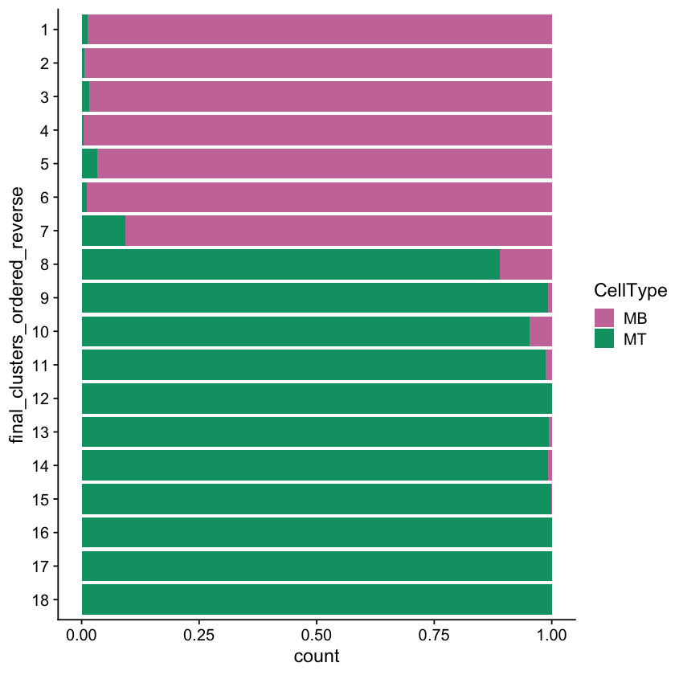

# Figure 4

#### For the TSS calling for both single-cell and bulk long-read
* BAM files output from minimap2 (from the processing steps outlined in [figure 1](https://github.com/fairliereese/2021_c2c12/tree/master/figure_1)) were filtered for reads that were assigned the known, NIC, NNC, or prefix-ISM novelty category by TALON that were identified via the read_annot TALON output, also from the steps in [figure 1](https://github.com/fairliereese/2021_c2c12/tree/master/figure_1)
* TSS peak regions were called on the filtered BAM with the [ENCODE PacBio TSS caller](https://github.com/ENCODE-AWG/tss-annotation/blob/master/long_read/pacbio_to_tss.py)
* The output TSS peak regions were filtered for those that were supported by more than 1 read
* Reads in the corresponding TALON-output read_annot files were associated with a TSS using bedtools intersect. Reads that did not intersect a TSS peak were not assigned a TSS
* Using the gene IDs present in the TALON read_annot files, each TSS was filtered on the gene level where each TSS was required to have a number of reads >10% (>5% for bulk) of the number of reads that supported the most highly-expressed TSS within the same genes

#### For the TES calling for both single-cell and bulk long-read
* BAM files output from minimap2 (from the processing steps outlined in [figure 1](https://github.com/fairliereese/2021_c2c12/tree/master/figure_1)) were filtered for reads that were assigned the known, NIC, NNC, or suffix-ISM novelty category by TALON that were identified via the read_annot TALON output, also from the steps in [figure 1](https://github.com/fairliereese/2021_c2c12/tree/master/figure_1)
* TES peak regions were called on the filtered BAM with the [ENCODE PacBio TSS caller](https://github.com/ENCODE-AWG/tss-annotation/blob/master/long_read/pacbio_to_tss.py)
* The output TES peak regions were filtered for those that were supported by more than 1 read
* Reads in the corresponding TALON-output read_annot files were associated with a TES using bedtools intersect. Reads that did not intersect a TES peak were not assigned a TES
* Using the gene IDs present in the TALON read_annot files, each TES was filtered on the gene level where each TES was required to have a number of reads >50% of the number of reads that supported the most highly-expressed TES within the same genes

#### Creating a Scanpy AnnData object for TSS expression
* After associating each read with a filtered TSS, reads per TSS per cell were summed up from the read_annot file
* Cell metadata was loaded in from the gene-level AnnData object and used along with the TSS expression to make a TSS-level AnnData object

## Figures made in R

```R
library(Signac)
library(Seurat)
library(rtracklayer)
library(GenomicRanges)
library(EnsDb.Mmusculus.v79)
library(viridis)
library(RColorBrewer)
library(ggplot2)
library(ggrepel)
library(UpSetR)
library(reshape2)
library(ggExtra)

source('../scripts/plotting.R')
```


```R
# filtered snATAC output from Signac
get_filt_atac <- function() {
    load('../processing/signac/sn_filt.rda')
    obj = mb_mt_atac
    return(obj)
}

# bed files for TSSs 
# bed files for TSSs 
get_tss_beds <- function() {
    sc_tss_10 = read.delim('../processing/ends/sc_tss_10_combo_gencode_prmenhP_cage_snatac18.bed')
    sc_tss_10_ends = read.delim('../processing/ends/sc_tss_10.sort.bed')
    return(list(sc_tss_10, sc_tss_10_ends))
}

# log2FC tables - MB vs. MT
get_mb_mt_fc_table <- function() {
    df = read.csv('../processing/ends/python_df_10pct_MBvsMT_nodupes.csv', header=T)
    return(df)
}
# log2FC tables - MB vs. MNC
get_mb_mnc_fc_table <- function() {
    df = read.csv('../processing/ends/python_df_10pct_MBvsMNC_nodupes.csv', header=T)
    return(df)
}
# log2FC tables - MNC vs. MT
get_mnc_mt_fc_table <- function() {
    df = read.csv('../processing/ends/python_df_10pct_MNCvsMT_nodupes.csv', header=T)
    return(df)
}
```

### Panel 4A


```R
mb_mt_atac = get_filt_atac()
colors = get_atac_clust_colors()

fname="figures/atac_UMAP_18clusters.pdf"
pdf(file=fname,
    width=5.5,height=5)
p = DimPlot(mb_mt_atac,
        group.by = 'final_clusters_ordered',
        label = T,cols = colors,label.size = 8) + NoLegend() + NoAxes()
p
dev.off()
p

colors = get_atac_sample_colors()
pdf(file = "figures/atac_barplot.pdf",
    width = 3.2,
    height = 4.5)
p = ggplot(mb_mt_atac@meta.data, aes(x=final_clusters_ordered_reverse, fill=CellType)) + 
  geom_bar(position = "fill")  + 
  scale_fill_manual(values=colors) + 
  coord_flip()
p 
dev.off()
p
```


    

    


### Panel 4C


```R
mb_mt_atac = get_filt_atac()
colors = get_atac_clust_colors()

fname="figures/atac_tnnt2_violin.pdf"
pdf(file=fname,
    width=3,height=11)
p = VlnPlot(mb_mt_atac,
        pt.size = 0, cols = rev(colors),
        "Tnnt2",
        assay ="RNA",
        group.by = "final_clusters_ordered_reverse") + coord_flip() + NoLegend()
p
dev.off()
p
```


    

    


### Panel 4C


```R
objs = get_tss_beds()
sc_tss_10 = objs[[1]]
sc_tss_10_ends = objs[[2]]

colnames(sc_tss_10) = c("end_chr","end_start","ends_stop","end_readID",
                        "end_score","end_strand","combo_chr","combo_start",
                        "combo_stop","combo_name","combo_score","combo_strand")
colnames(sc_tss_10_ends) = c("end_chr","end_start","ends_stop","end_readID",
                             "end_score","end_strand")

sc_tss_10$end_id_nreads = sapply(strsplit(as.character(sc_tss_10$end_readID), "ccs_"), "[[", 2)
sc_tss_10_ends$end_id_nreads = sapply(strsplit(as.character(sc_tss_10_ends$end_readID), "ccs_"), "[[", 2)

tss_missing = sc_tss_10_ends$end_id_nreads[which((sc_tss_10_ends$end_id_nreads %in% sc_tss_10$end_id_nreads) == FALSE)]
tss_missing = as.data.frame(tss_missing)
tss_missing$cage_mm10 = rep(0, length(tss_missing))
tss_missing$enhP = rep(0, dim(tss_missing)[1])
tss_missing$gencode_TSS = rep(0, dim(tss_missing)[1])
tss_missing$prom = rep(0, dim(tss_missing)[1])
tss_missing$snATAC = rep(0, dim(tss_missing)[1])

sc_tss_10_smol = sc_tss_10[,c("end_id_nreads","combo_name")]
sc_tss_10_table = dcast(sc_tss_10_smol,end_id_nreads~combo_name,fun.aggregate = function(x){as.integer(length(x) > 0)})
colnames(tss_missing) = colnames(sc_tss_10_table)
sc_tss_10_table = rbind(sc_tss_10_table, tss_missing)
sc_tss_10_table$TSS = rep(1,dim(sc_tss_10_table)[1])

fname  = "figures/sc_tss_10pct_upset.pdf"
pdf(file = fname,   
    width = 10,
    height = 4)
p = upset(
  sc_tss_10_table,
  nsets = 7,
  nintersects = NA,
  order.by = "freq",
  line.size = 1.2,
  point.size = 3.5,
  text.scale = 1.5,
  mb.ratio = c(0.5, 0.5),
  main.bar.color = "#56B4E9",
  matrix.color="#56B4E9"
)
p
dev.off()
p
```
    

    


### Panel 4F


```R
df = get_mb_mt_fc_table()

df = df[!(is.na(df$log2fc_tss)),]
df = df[!(is.na(df$log2fc_atac)),]

mt_both = df[df$log2fc_tss > sd((df$log2fc_tss))*2 & df$log2fc_atac > sd((df$log2fc_atac))*2,]
mt_both$marker_celltype= rep("MT",dim(mt_both)[1])
mb_both = df[df$log2fc_tss < -sd((df$log2fc_tss))*2 & df$log2fc_atac < -sd((df$log2fc_atac))*2,]
mb_both$marker_celltype= rep("MB",dim(mb_both)[1])
plot_highlight1 = rbind(mt_both,mb_both)

mt_both = df[df$log2fc_tss > sd((df$log2fc_tss))*2 & df$log2fc_atac < -sd((df$log2fc_atac))*2,]
mt_both$marker_celltype= rep("MT",dim(mt_both)[1])
mb_both = df[df$log2fc_tss < -sd((df$log2fc_tss))*2 & df$log2fc_atac > sd((df$log2fc_atac))*2,]
mb_both$marker_celltype= rep("MB",dim(mb_both)[1])
plot_highlight2 = rbind(mt_both,mb_both)

mt_both = df[df$log2fc_tss > sd((df$log2fc_tss))*3.1 & df$log2fc_atac > sd((df$log2fc_atac))*3.1,]
mt_both$marker_celltype= rep("MT",dim(mt_both)[1])
mb_both = df[df$log2fc_tss < -sd((df$log2fc_tss))*3.2 & df$log2fc_atac < -sd((df$log2fc_atac))*3.2,]
mb_both$marker_celltype= rep("MB",dim(mb_both)[1])
plot_highlight3 = rbind(mt_both,mb_both)


p = ggplot(df, aes(x=log2fc_tss, y=log2fc_atac)) +
  geom_point(fill='grey',size=1.75, color = "grey",pch=21) + theme_minimal() +
  geom_point(data=plot_highlight1,aes(x=log2fc_tss,y=log2fc_atac,color = marker_celltype),size=2.2) + 
  scale_color_manual(values = c("#cb79a7", "#08684c")) +
  geom_hline(yintercept=-sd((df$log2fc_atac))*2, linetype="dashed", color = "black") +
  geom_hline(yintercept=sd((df$log2fc_atac))*2, linetype="dashed", color = "black")+
  geom_vline(xintercept=-sd((df$log2fc_tss))*2, linetype="dashed", color = "black") +
  geom_vline(xintercept=sd((df$log2fc_tss))*2, linetype="dashed", color = "black")+
  geom_point(data=plot_highlight2,aes(x=log2fc_tss,y=log2fc_atac),color = "black",size=1.75) +
  geom_label_repel(data=plot_highlight3,
                   aes(label=gene_name),
                   box.padding = unit(0.35, "lines"),
                   point.padding = unit(0.5, "lines"),
                   force = 3) +
  theme(legend.position = "none",axis.text=element_text(size=12),
        axis.title=element_text(size=14)) + 
  xlab("Log2FC expression MT/MB") +
  ylab("Log2FC accessibility MT/MB")

fname = "figures/tss_10_mtvsmb_sectors_2SD.pdf"
pdf(file = fname,
    width = 10,
    height = 10)
p = ggMarginal(p, type = "density", margins = "both",colour = "grey",size = 8)
p
dev.off()
p
```
    

    


### Panel 4G


```R
df = get_mb_mnc_fc_table()

df = df[!(is.na(df$log2fc_tss)),]
df = df[!(is.na(df$log2fc_atac)),]
mnc_both = df[df$log2fc_tss > sd(df$log2fc_tss)*2 & df$log2fc_atac > sd(df$log2fc_atac)*2,]
mnc_both$marker_celltype= rep("MT",dim(mnc_both)[1])
mb_both = df[df$log2fc_tss < -sd(df$log2fc_tss)*2 & df$log2fc_atac < -sd(df$log2fc_atac)*2,]
mb_both$marker_celltype= rep("MB",dim(mb_both)[1])
plot_highlight4 = rbind(mnc_both,mb_both)

mnc_both = df[df$log2fc_tss > sd(df$log2fc_tss)*2 & df$log2fc_atac < -sd(df$log2fc_atac)*2,]
mnc_both$marker_celltype= rep("MT",dim(mnc_both)[1])
mb_both = df[df$log2fc_tss < -sd(df$log2fc_tss)*2 & df$log2fc_atac > sd(df$log2fc_atac)*2,]
mb_both$marker_celltype= rep("MB",dim(mb_both)[1])
plot_highlight5 = rbind(mnc_both,mb_both)

mnc_both = df[df$log2fc_tss > sd(df$log2fc_tss)*2 & df$log2fc_atac > sd(df$log2fc_atac)*2,]
mnc_both$marker_celltype= rep("MT",dim(mnc_both)[1])
mb_both = df[df$log2fc_tss < -sd(df$log2fc_tss)*3.2 & df$log2fc_atac < -sd(df$log2fc_atac)*3.2,]
mb_both$marker_celltype= rep("MB",dim(mb_both)[1])
plot_highlight6 = rbind(mnc_both,mb_both)

p = ggplot(df, aes(x=log2fc_tss, y=log2fc_atac)) +
  geom_point(fill='grey',size=1.75, color = "grey",pch=21) + theme_minimal() +
  geom_point(data=plot_highlight4,aes(x=log2fc_tss,y=log2fc_atac,color = marker_celltype),size=2.2) + 
  scale_color_manual(values = c("#cb79a7", "#019f73")) +
  geom_hline(yintercept=-sd((df$log2fc_atac))*2, linetype="dashed", color = "black") +
  geom_hline(yintercept=sd((df$log2fc_atac))*2, linetype="dashed", color = "black")+
  geom_vline(xintercept=-sd((df$log2fc_tss))*2, linetype="dashed", color = "black") +
  geom_vline(xintercept=sd((df$log2fc_tss))*2, linetype="dashed", color = "black")+
  geom_point(data=plot_highlight5,aes(x=log2fc_tss,y=log2fc_atac),color = "black",size=1.75) +
  geom_label_repel(data=plot_highlight6,
                   aes(label=gene_name),
                   box.padding = unit(0.35, "lines"),
                   point.padding = unit(0.5, "lines"),
                   force = 3) +
  theme(legend.position = "none",axis.text=element_text(size=12),
        axis.title=element_text(size=14)) + 
  xlab("Log2FC expression MNC/MB") + 
  ylab("Log2FC accessibility MNC/MB")

fname = "figures/tss_10_mncvsmb_sectors_2SD.pdf"
pdf(file = fname,
    width =10,
    height = 10)
p = ggMarginal(p, type = "density", margins = "both",colour = "grey",size = 8)
p
dev.off()
p
```

    

    


### Panel 4H


```R
df = get_mnc_mt_fc_table()

df = df[!(is.na(df$log2fc_tss)),]
df = df[!(is.na(df$log2fc_atac)),]
mt_both = df[df$log2fc_tss > sd(df$log2fc_tss)*2 & df$log2fc_atac > sd(df$log2fc_atac)*2,]
mt_both$marker_celltype= rep("MT",dim(mt_both)[1])
mnc_both = df[df$log2fc_tss < -sd(df$log2fc_tss)*2 & df$log2fc_atac < -sd(df$log2fc_atac)*2,]
mnc_both$marker_celltype= rep("MB",dim(mnc_both)[1])
plot_highlight7 = rbind(mt_both,mnc_both)

mt_both = df[df$log2fc_tss > sd(df$log2fc_tss)*2 & df$log2fc_atac < -sd(df$log2fc_atac)*2,]
mt_both$marker_celltype= rep("MT",dim(mt_both)[1])
mnc_both = df[df$log2fc_tss < -sd(df$log2fc_tss)*2 & df$log2fc_atac > sd(df$log2fc_atac)*2,]
mnc_both$marker_celltype= rep("MB",dim(mnc_both)[1])
plot_highlight8 = rbind(mt_both,mnc_both)

mt_both = df[df$log2fc_tss > sd(df$log2fc_tss)*4.7 & df$log2fc_atac > sd(df$log2fc_atac)*4.7,]
mt_both$marker_celltype= rep("MT",dim(mt_both)[1])
mnc_both = df[df$log2fc_tss < -sd(df$log2fc_tss)*2.5 & df$log2fc_atac < -sd(df$log2fc_atac)*2.5,]
mnc_both$marker_celltype= rep("MB",dim(mnc_both)[1])
plot_highlight9 = rbind(mt_both,mnc_both)

p = ggplot(df, aes(x=log2fc_tss, y=log2fc_atac)) +
  geom_point(fill='grey',size=1.75, color = "grey",pch=21) + theme_minimal() +
  geom_point(data=plot_highlight7,aes(x=log2fc_tss,y=log2fc_atac,color = marker_celltype),size=2.2) + 
  scale_color_manual(values = c("#019f73", "#08684c")) +
  geom_hline(yintercept=-sd(df$log2fc_atac)*2, linetype="dashed", color = "black") +
  geom_hline(yintercept=sd(df$log2fc_atac)*2, linetype="dashed", color = "black")+
  geom_vline(xintercept=-sd(df$log2fc_tss)*2, linetype="dashed", color = "black") +
  geom_vline(xintercept=sd(df$log2fc_tss)*2, linetype="dashed", color = "black")+
  geom_point(data=plot_highlight8,aes(x=log2fc_tss,y=log2fc_atac),color = "black",size=1.75) +
  geom_label_repel(data=plot_highlight9,
                   aes(label=gene_name),
                   box.padding = unit(0.35, "lines"),
                   point.padding = unit(0.5, "lines"),
                   force = 3) +
  theme(legend.position = "none",axis.text=element_text(size=12),
        axis.title=element_text(size=14)) + 
  xlab("Log2FC expression Myog+ MT/MNC") + 
  ylab("Log2FC accessibility Myog+ MT/MNC")

fname = "figures/tss_10_mtvsmnc_sectors_2SD.pdf"
pdf(file = fname,
    width = 10,
    height = 10)
p = ggMarginal(p, type = "density", margins = "both",colour = "grey",size = 8)
p
dev.off()
p
```

    


## Figures made in Python

```python
import pandas as pd
import sys
import os
import scanpy as sc
import swan_vis as swan

p = os.path.dirname(os.getcwd())
sys.path.append(p)

from scripts.utils import *
from scripts.plotting import *
```

```python
# read in the data relevant for this figure

# output from TALON
def get_sc_data():
    fname = '../processing/talon/sc_talon_read_annot.tsv'

    df = pd.read_csv(fname, sep='\t')
    
    return df

# output from TSS calling script
def get_tss_bed():

    fname = '../processing/ends/sc_tss.bed'
    df = pd.read_csv(fname, sep='\t', header=None, usecols=[3,9])
    df.columns = ['peak_id', 'read_name']
    
    return df

# output from calculating TSS expression per cell 
# and adding it to scanpy
def get_tss_raw_adata():
    fname = '../processing/scanpy/sc_tss_raw.h5ad'
    adata = sc.read(fname)
    
    return adata

# output from Swan to get expression of TSS AND transcript
# note: this could have also been done from the adata file
# which is why Swan is not mentioned in the methods
# it just happens that I wrote the plotting and data formatting
# code for some of these figures using the Swan output
def get_swan_data():
    fname = '../processing/swan/sc_tss_iso_swan.p'
    sg = swan.SwanGraph(fname)
    t_df = sg.t_df
    cell_type_map = {'Cluster_1_counts': '1', 
                 'Cluster_2_counts': '2', 
                 'Cluster_3_counts': '3', 
                 'Cluster_4_counts': '4', 
                 'Cluster_5_counts': '5', 
                 'Cluster_6_counts': '6', 
                 'Cluster_7_counts': '7'}
    t_df.rename(cell_type_map, axis=1, inplace=True)
    return t_df
```

### Panel 4C


```python
df = get_sc_data()
tss = get_tss_bed()

ylim = 11
xlim = 5

opref = 'figures/sc_tss'

plot_ends_iso_cell(df, tss, opref, kind='tss', xlim=xlim, ylim=ylim)
```


    

    


### Panel 4E


```python
groups = ['1', '2', '3', '4', '5', '6', '7']
group_names = groups
adata = get_tss_raw_adata()
t_df = get_swan_data()

plot_tss_iso_heatmap(adata, t_df, groups, group_names, 'Tnnt2', 'figures/tss_iso')
```

    Graph from ../processing/swan/sc_tss_iso_swan.p loaded


    /Users/fairliereese/miniconda3/lib/python3.7/site-packages/pandas/core/frame.py:4169: SettingWithCopyWarning: 
    A value is trying to be set on a copy of a slice from a DataFrame
    
    See the caveats in the documentation: https://pandas.pydata.org/pandas-docs/stable/user_guide/indexing.html#returning-a-view-versus-a-copy
      errors=errors,


    

    

