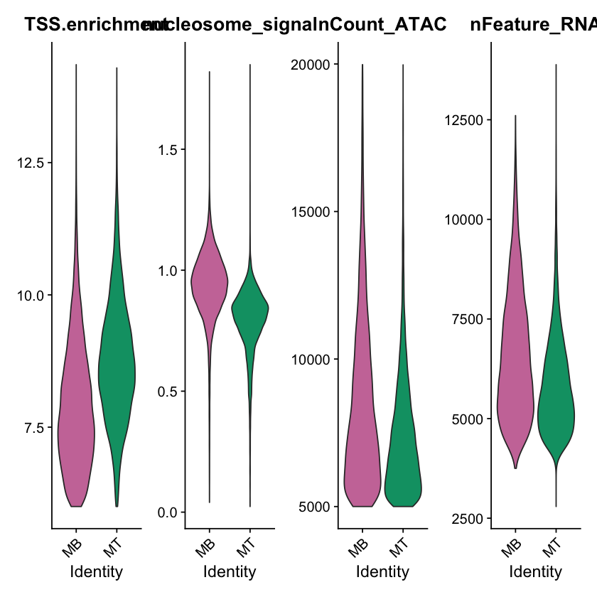
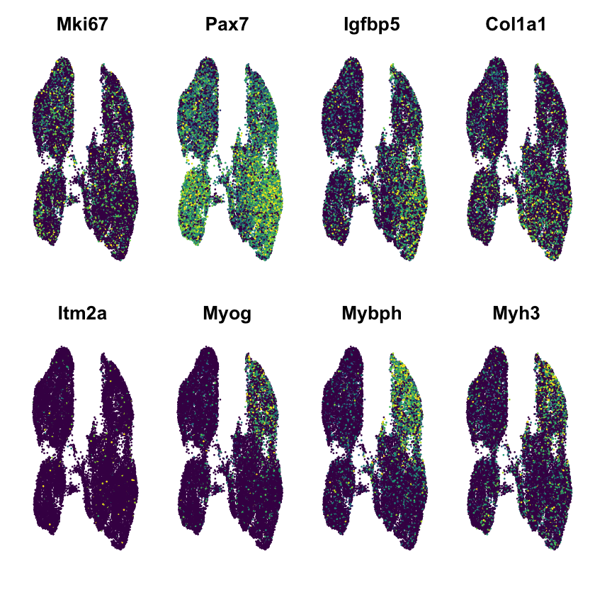
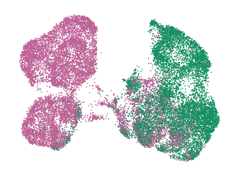
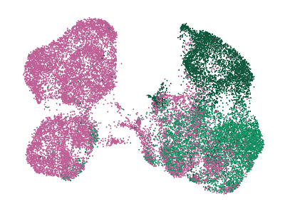
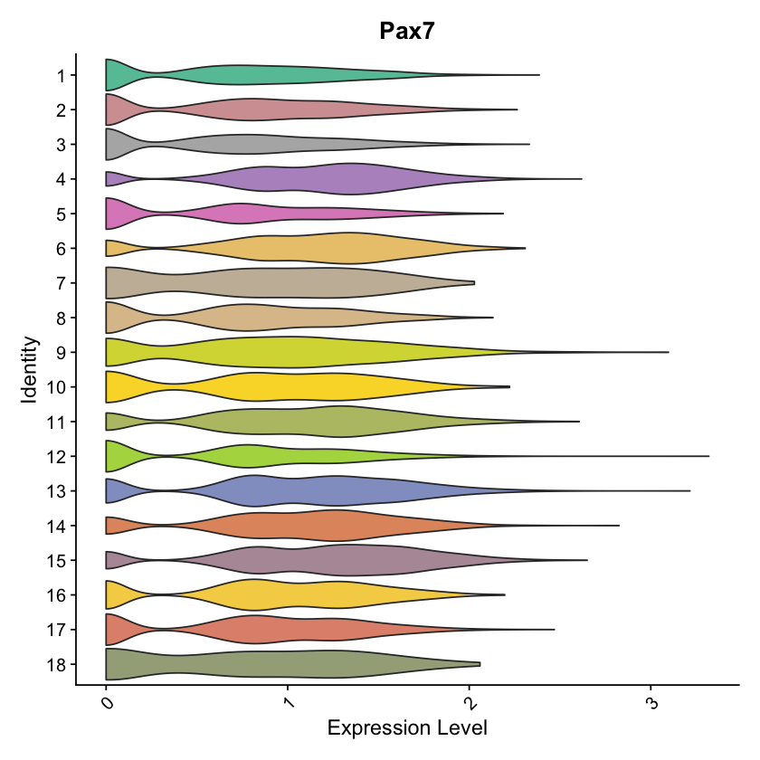
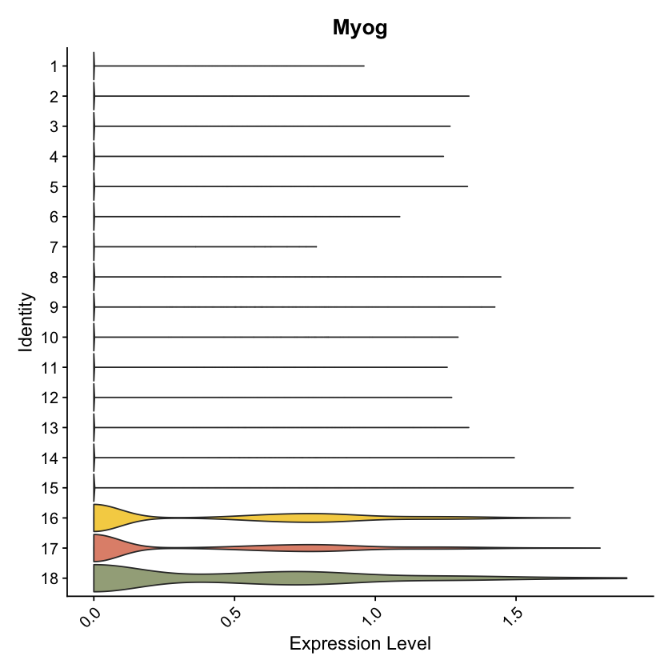
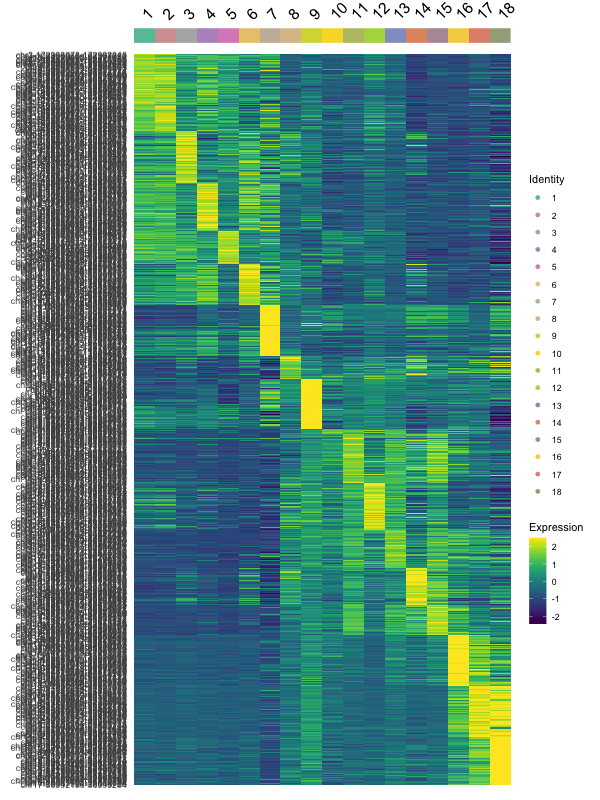

# Figure S4

#### For the short-read sc/sn RNA-seq data
* TODO @Liz

#### For the short-read snATAC-seq data
* TODO @Liz

```R
library(Signac)
library(Seurat)
library(ggplot2)
library(dplyr)
library(EnsDb.Mmusculus.v79)
library(viridis)
set.seed(1234)

source('../scripts/plotting.R')
```


```R
# filtered snATAC output from Signac
get_filt_atac <- function() {
    load('../processing/signac/sn_filt.rda')
    obj = mb_mt_atac
    return(obj)
}

# RNA + ATAC integration 
get_rna_atac <- function() {
    load('../processing/signac/atac_rna_integrated.rda')
    transfer.anchors = transfer.anchors
    return(transfer.anchors)
}

# unfiltered 40k cell dataset output from Seurat
get_40k_sc_data <- function() {
    load('../processing/seurat/sc_40k.rda')
    seurat_obj = mb_mt
    return(seurat_obj)
}
```

### Panel S4B


```R
obj = get_filt_atac()
colors = get_atac_sample_colors()

fname="figures/qc_violin_snatac.pdf"
pdf(file=fname,
    width =  10, 
    height = 6)
p = VlnPlot(
  object = obj,
  features = c('TSS.enrichment', 'nucleosome_signal','nCount_ATAC','nFeature_RNA'),
  pt.size = 0,
  ncol = 4,
  group.by = "CellType",
  cols = colors)
p
dev.off()
p
```

    

    


### Panel S4C


```R
obj = get_filt_atac()

DefaultAssay(obj)="RNA"
genes = c("Mki67","Pax7","Igfbp5","Col1a1","Itm2a","Myog","Mybph","Myh3")
fname  = "figures/featureplots_snatac.pdf"
pdf(file=fname,
    width = 7.8, 
    height = 4)
p = FeaturePlot(obj, order=F, pt.size = 0.1,
            features = genes,ncol =4,
            max.cutoff = 'q95') & NoLegend() & NoAxes() & 
  scale_colour_gradientn(colours = viridis(11))
p
dev.off()
p
```


    


### Panel S4D


```R
mb_mt = get_40k_sc_data()
transfer = get_rna_atac()
mb_mt_atac = get_filt_atac()
colors = get_atac_sample_colors()

mb_mt@meta.data$grouped_clusters  = mb_mt@meta.data$final_clusters_ordered 
Idents(mb_mt) = mb_mt@meta.data$grouped_clusters
mb_mt=RenameIdents(mb_mt,
                   '1'='MB', 
                   '2'='MB',
                   '3'='MB',
                   '4'='MB',
                   '5'='MB',
                   '6'='MB',
                   '7'='MB',
                   '8'='MNC',
                   '9'='MNC',
                   '10'='MNC',
                   '11'='MNC',
                   '12'='MNC',
                   '13'='MNC',
                   '14'='MNC',
                   '15'='MNC',
                   '16'='MT',
                   '17'='MT',
                   '18'='MT',
                   '19'='MT',
                   '20'='MT')
mb_mt@meta.data$grouped_clusters = Idents(mb_mt) 
predicted.labels_celltype = TransferData(
  anchorset = transfer.anchors,
  refdata = mb_mt$CellType,
  weight.reduction = mb_mt_atac[['lsi']],
  dims = 4:30
)

mb_mt_atac = AddMetaData(object=mb_mt_atac,
                         metadata=predicted.labels_celltype)
                         
fname="figures/atac_rna_integration_celltype.pdf"
pdf(file=fname,
    width=5.5,height=5)
p = DimPlot(mb_mt_atac,
        group.by = 'predicted.id',
        label = F,cols = colors) + NoLegend() + NoAxes()
p
dev.off()
p

colors = get_celltype_colors()
            
predicted.labels_3celltypes = TransferData(
  anchorset = transfer.anchors,
  refdata = mb_mt$grouped_clusters,
  weight.reduction = mb_mt_atac[['lsi']],
  dims = 4:30
)

mb_mt_atac = AddMetaData(object = mb_mt_atac, metadata = predicted.labels_3celltypes)
fname="figures/atac_rna_integration_3celltype.pdf"
pdf(file=fname,
    width=5.5,height=5)
p = DimPlot(mb_mt_atac,
        group.by = 'predicted.id',
        label = F,cols = colors) + NoLegend() + NoAxes()
p
dev.off()
p
```






### Panel S4E


```R
mb_mt_atac = get_filt_atac()
colors = get_atac_clust_colors()

pdf(file=fname,
    width=3,height=11)
p = VlnPlot(mb_mt_atac,
        pt.size = 0, cols = rev(colors),
       "Pax7",
       assay ="RNA",
       group.by = "final_clusters_ordered_reverse") + coord_flip() + NoLegend()
p
dev.off()
p
```

    

    


### Panel S4F


```R
mb_mt_atac = get_filt_atac()
colors = get_atac_clust_colors()

fname="figures/atac_myog_violin.pdf"
pdf(file=fname,
    width=3,height=11)
p = VlnPlot(mb_mt_atac,
        pt.size = 0, cols = rev(colors),
        "Myog",
        assay ="RNA",
        group.by = "final_clusters_ordered_reverse") + coord_flip() + NoLegend()
p
dev.off()
p
```

  

    


### Panel S4G


```R
mb_mt_atac = get_filt_atac()
colors = get_atac_clust_colors()

DefaultAssay(mb_mt_atac)="ATAC"
Idents(mb_mt_atac) = mb_mt_atac$final_clusters_ordered
cluster.averages <- AverageExpression(mb_mt_atac, return.seurat = TRUE)

mb_mt.atac.markers <- FindAllMarkers(mb_mt_atac, only.pos = TRUE, min.pct = 0.1, logfc.threshold = 0.5)
mb_mt.atac.markers = mb_mt.atac.markers[mb_mt.atac.markers$p_val_adj < 0.05,]

top10 <- mb_mt.atac.markers %>% group_by(cluster) %>% top_n(n = 50, wt = avg_logFC)

fname="figures/atac_heatmap.pdf"
pdf(file=fname,
    width=7,height=12)
p = DoHeatmap(cluster.averages, label=T,features = top10$gene, group.colors = colors, raster=F,draw.lines = FALSE) + scale_fill_viridis() 
p
dev.off()
p
```



