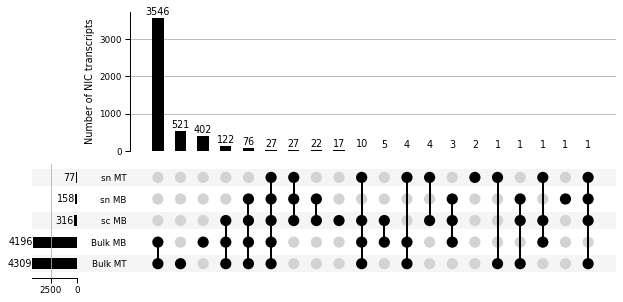
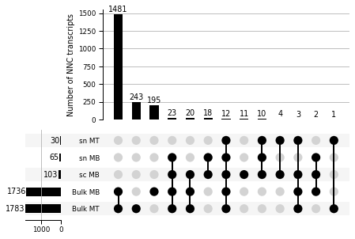

# Figure S1

#### For the long-read single-cell data
* The single-cell long-read data was demultiplexed and processed as detailed in [figure 1](https://github.com/fairliereese/2021_c2c12/tree/master/figure_1)

```python
import pandas as pd
import sys
import os

p = os.path.dirname(os.getcwd())
sys.path.append(p)

from scripts.utils import *
from scripts.plotting import *
```


```python
# read in the data relevant for this figure

# output from the TALON run on single-cell
def get_sc_data():
    fname = '../processing/talon/sc_talon_read_annot.tsv'

    df = pd.read_csv(fname, sep='\t')
    df = add_read_annot_metadata(df)
    
    return df

# output from the TALON run on single-ell
def get_sc_ab_data():
    fname = '../processing/talon/sc_talon_abundance_filtered.tsv'
    df = pd.read_csv(fname, sep='\t')    
    df['experiment'] = 'bulk'
    return df

# output from the TALON run on bulk
def get_bulk_ab_data():
    fname = '../processing/talon/bulk_talon_abundance_filtered.tsv'
    df = pd.read_csv(fname, sep='\t')
    
    # remove SIRVs and ERCCs
    df = df.loc[~df.annot_gene_id.str.contains('SIRV')]
    df = df.loc[~df.annot_gene_id.str.contains('ERCC')]
    
    df['experiment'] = 'sc'
    return df

# unfiltered output from the TALON run on bulk and single-cell
def get_sc_bulk_data():
    fname = '../processing/talon/bulk_sc_talon_read_annot.tsv'

    df = pd.read_csv(fname, sep='\t')
    df = add_read_annot_metadata(df, bulk=True)
    
    return df

# output from the demultiplexing code, pre- and post-barcode correction
def get_bc_data():
    fname = '../processing/demultiplexing/bcs_pre_correction.tsv'
    pre = pd.read_csv(fname, sep='\t', usecols=[15,16,17,18])
    fname = '../processing/demultiplexing/bcs_post_correction.tsv'
    post = pd.read_csv(fname, sep='\t', usecols=[15,19,20,21])
    
    pre['state'] = 'Pre-correction'
    post['state'] = 'Post-correction'
    
    df = pd.concat([pre, post])
    return df    
```

### Panel S1B


```python
opref = 'figures/pre_post'
df = get_bc_data()
plot_umis_v_barcodes(df, opref)	
```


    

    


### Panel S1C


```python
plot_umis_per_cell(df, opref)	
```
    

    


### Panel S1D


```python
opref = 'figures/sc_unfiltered'
df = get_sc_data()
c_dict, order = get_talon_nov_colors()
plot_transcript_novelty(df, opref, c_dict, order,
                        title='Uniltered', ylim=230000)
```

      transcript_novelty  counts
    0          Antisense   31092
    1            Genomic  214230
    2                ISM  146232
    3         Intergenic   18959
    4              Known   22279
    5                NIC   15502
    6                NNC   17784


    

    


### Panel S1E


```python
opref = 'figures/bulk_vs_sc'
bulk = get_bulk_ab_data()
sc = get_sc_ab_data()
gtf = '/Users/fairliereese/Documents/programming/mortazavi_lab/ref/gencode.vM21/gencode.vM21.annotation.gtf'
plot_len_boxplot(sc, bulk, gtf, opref, kind='gene')
```


    

    


### Panel S1F


```python
opref = 'figures/bulk_vs_sc'
bulk = get_bulk_ab_data()
sc = get_sc_ab_data()
gtf = '/Users/fairliereese/Documents/programming/mortazavi_lab/ref/gencode.vM21/gencode.vM21.annotation.gtf'
plot_len_boxplot(sc, bulk, gtf, opref, kind='transcript')
```


    

    


### Panel S1G


```python
df = get_sc_bulk_data()
plot_exon_hist(df, 'figures/bulk_vs_sc')
```

    

    


    

    


    

    


### Panel S1H


```python
opref = 'figures/bulk_vs_sc'
bulk = get_bulk_ab_data()
sc = get_sc_ab_data()
gtf = '/Users/fairliereese/Documents/programming/mortazavi_lab/ref/gencode.vM21/gencode.vM21.annotation.gtf'
```


```python
_, _ = plot_upset_plot(bulk, sc, opref, gtf, kind='transcript', novelty='NIC')
```


    

    


```python
plot_detection_venn(bulk, sc, opref, transcript_nov='NIC', \
                    sample='MB', cell_part='cell')
```


    

    


```python
plot_detection_venn(bulk, sc, opref, transcript_nov='NIC', \
                    sample='MB', cell_part='nucleus')
```


    

    


```python
plot_detection_venn(bulk, sc, opref, transcript_nov='NIC', \
                    sample='MT', cell_part='nucleus')
```


    

    


### Panel S1I


```python
_, _ = plot_upset_plot(bulk, sc, opref, gtf, kind='transcript', novelty='NNC')
```


    

    


```python
plot_detection_venn(bulk, sc, opref, transcript_nov='NNC', \
                    sample='MB', cell_part='cell')
```


    

    


```python
plot_detection_venn(bulk, sc, opref, transcript_nov='NNC', \
                    sample='MB', cell_part='nucleus')
```


    

    


```python
plot_detection_venn(bulk, sc, opref, transcript_nov='NNC', \
                    sample='MT', cell_part='nucleus')
```


    

    
