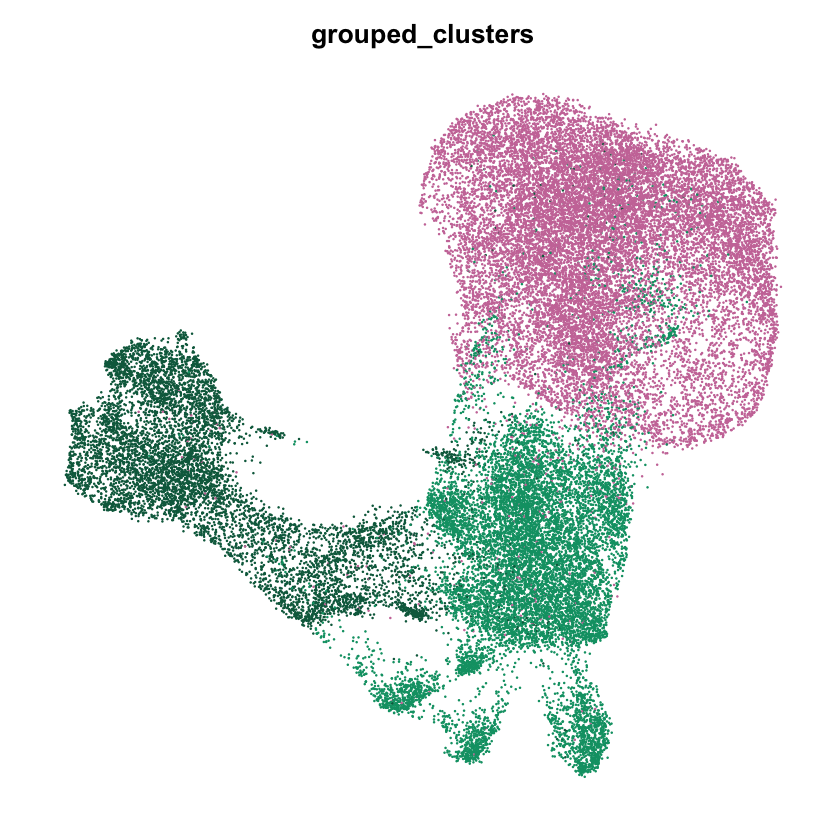
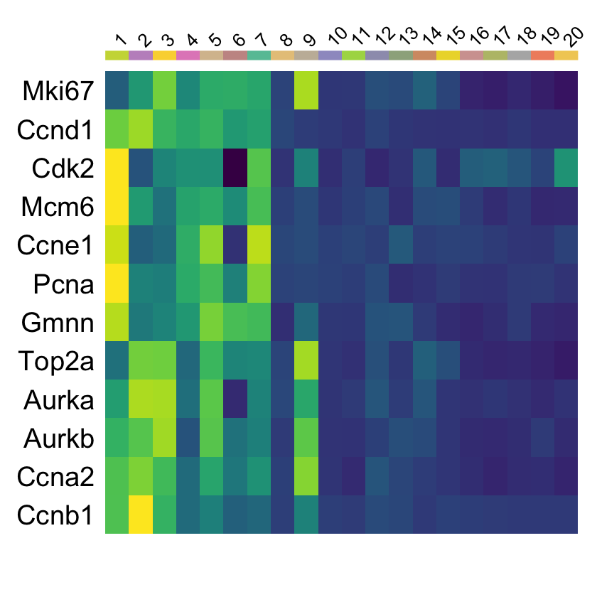

# Figure S2

#### For the short-read single-cell data
* TODO @Liz

Panels A, B, D were output from the Splitpipe code


```R
library(Seurat)
library(tidyverse)
library(viridis)
library(RColorBrewer)
options(stringsAsFactors = FALSE)

source('../scripts/plotting.R')
```


```R
# unfiltered 40k cell dataset output from Seurat
get_40k_sc_data <- function() {
    load('../processing/seurat/sc_40k.rda')
    seurat_obj <- mb_mt
    return(seurat_obj)
}

# unfiltered 1k cell (with matching long reads) dataset output from Seurat
get_1k_sc_data <- function() {
    load('../processing/seurat/sc_1k.rda')
    seurat_obj <- mb_mt_1k
    return(seurat_obj)
}

# filtered 40k cell dataset output from seurat
get_40k_sc_filt_data <- function() {
    load('../processing/seurat/sc_40k_filt.rda')
    seurat_obj <- mb_mt_filt
    return(seurat_obj)
}
```

### Panel S2C


```R
seurat_obj = get_1k_sc_data()
colors = get_sample_colors()

fname = "figures/qc_violinplot_464cells.pdf"
pdf(file = fname,
    width = 6,
    height = 5)
p = VlnPlot(seurat_obj,
        features = c("nFeature_RNA", "nCount_RNA", "percent.mt"),
        group.by = "SampleType",
        pt.size = 0.5,
        ncol = 3,
        cols = colors)
p
dev.off()
p
```


    


### Panel S2E


```R
seurat_obj = get_40k_sc_filt_data()
colors = get_sample_colors()

fname = "figures/qc_violinplot_allcells.pdf"
pdf(file = fname,
    width = 6,
    height = 5)
p = VlnPlot(seurat_obj,
            features = c("nFeature_RNA", "nCount_RNA", "percent.mt"),
            group.by = "SampleType",
            pt.size = 0, ncol = 3, cols = colors)
p
dev.off()
p
```


    


### Panel S2F


```R
seurat_obj = get_1k_sc_data()

genes = c("Mki67","Hmga2","Pax7","Igfbp5","Col3a1","Col1a1","Myog","Mybph","Myh3","Rbm24")
fname = "figures/464_shortreads_featureplots_ordered.pdf"
pdf(file = fname,
    width = 10, 
    height = 4)
p = FeaturePlot(seurat_obj,
                order=T,
                ncol=5,
                features = genes) & NoLegend() & NoAxes() & 
  scale_colour_gradientn(colours = viridis(11))
p
dev.off()
p
```


    


### Panel S2G


```R
seurat_obj = get_40k_sc_data()
colors = get_celltype_colors()

seurat_obj@meta.data$grouped_clusters  = seurat_obj@meta.data$final_clusters_ordered 
Idents(seurat_obj) = seurat_obj@meta.data$grouped_clusters

seurat_obj=RenameIdents(seurat_obj,
                   '1'='MB', 
                   '2'='MB',
                   '3'='MB',
                   '4'='MB',
                   '5'='MB',
                   '6'='MB',
                   '7'='MB',
                   '8'='MNC',
                   '9'='MNC',
                   '10'='MNC',
                   '11'='MNC',
                   '12'='MNC',
                   '13'='MNC',
                   '14'='MNC',
                   '15'='MNC',
                   '16'='MT',
                   '17'='MT',
                   '18'='MT',
                   '19'='MT',
                   '20'='MT')
seurat_obj@meta.data$grouped_clusters = Idents(seurat_obj)

fname = "figures/shortread_umap_mb_mt_mnc.pdf"
pdf(file = fname,
    width = 5.5, 
    height = 5)
p = DimPlot(
  object = seurat_obj,
  group.by = "grouped_clusters",
  label = F,label.size = 6,
  repel = TRUE)  + NoLegend() + NoAxes()+ scale_color_manual(values = colors)
p
dev.off()
p
```
    

    


### Panel S2G


```R
obj_40k = get_40k_sc_data()
obj_1k = get_1k_sc_data()
colors = get_40k_clust_colors()

cellID_clusters  = as.data.frame(obj_40k$final_clusters_ordered)
cellID_clusters$cellID  =sapply(strsplit( sapply(strsplit(rownames(cellID_clusters), ":"), "[[", 2), "_"), "[[", 1)
cellID_clusters$sublib  =sapply(strsplit( sapply(strsplit(rownames(cellID_clusters), ":"), "[[", 2), "_"), "[[", 2)

# Get cell ID and cluster from big object
cellID_clusters_464 = cellID_clusters[cellID_clusters$sublib == "1kx" & cellID_clusters$cellID %in% colnames(obj_1k),]
cellID_clusters_464 = cellID_clusters_464[match(colnames(obj_1k), cellID_clusters_464$cellID),]
table(cellID_clusters_464$cellID == colnames(obj_1k)) # yes

obj_1k$clusters_20 = cellID_clusters_464$`obj_40k$final_clusters_ordered`

fname = "figures/shortread_umap_464cells_20clust.pdf"
pdf(file = fname,
    width = 5.5, 
    height = 5)
p = DimPlot(
  object = obj_1k,pt.size = 2.2,
  group.by = "clusters_20",
  label = F,label.size = 6,
  repel = TRUE)  + NoLegend() + NoAxes()+ scale_color_manual(values = colors)
p
dev.off()
p
```


    


### Panel S2H


```R
mb_mt = get_40k_sc_data()
colors = get_40k_clust_colors()

Idents(mb_mt) = mb_mt@meta.data$final_clusters_ordered
cluster.averages <- AverageExpression(mb_mt, return.seurat = TRUE)

# G1: Mki67, Ccnd1, Cdk2, Mcm6 
# G1/S: Ccne1 (and a1, a2)
# S: Pcna
# G2: Gmnn
# G2M: Top2a, Aurka, Aurkb, Ccna2 (no a1 expr)
# M: Ccnb1
cycle = c("Mki67","Ccnd1","Cdk2","Mcm6",
          "Ccne1","Pcna","Gmnn","Top2a","Aurka","Aurkb","Ccna2","Ccnb1")

fname = "figures/heatmap_20clusters_cellcycle.pdf"
pdf(file=fname,
    width = 3, 
    height = 2.75)
p = DoHeatmap(cluster.averages, label=T,features = cycle, 
          group.colors = colors, raster=F,draw.lines = FALSE) + 
  scale_fill_viridis() + theme(axis.text.y = element_text(size = 23)) & NoLegend()
p
dev.off()
p
```


    


### Panel S2I


```R
seurat_obj = get_40k_sc_data()

Idents(seurat_obj) = seurat_obj@meta.data$final_clusters_ordered
cluster.averages <- AverageExpression(seurat_obj, return.seurat = TRUE)

seurat_obj.markers <- FindAllMarkers(seurat_obj, only.pos = TRUE, min.pct = 0.1, logfc.threshold = 0.1)
seurat_obj.markers = seurat_obj.markers[seurat_obj.markers$p_val_adj < 0.01,] # this is the same df as the marker table in the processing directory

top10 <- seurat_obj.markers %>% group_by(cluster) %>% top_n(n = 10, wt = avg_logFC)


fname = "figures/heatmap_20clusters_top10.pdf"
pdf(file=fname,
    width = 8, 
    height = 9.5)
p = DoHeatmap(cluster.averages, label=T,features = top10$gene, group.colors = colors, raster=F,draw.lines = FALSE) + 
  scale_fill_viridis() + theme(axis.text.y = element_text(size = 6))
p
dev.off()
p
```


    

