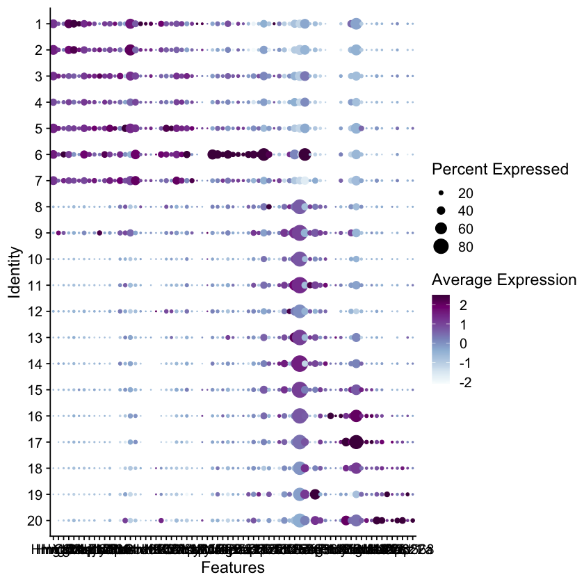

# Figure S3

#### For the short-read sc/sn RNA-seq data
* TODO @Liz


```R
library(Signac)
library(Seurat)
library(ggplot2)
library(dplyr)
library(EnsDb.Mmusculus.v79)
library(viridis)
set.seed(1234)

source('../scripts/plotting.R')
```

```R
# unfiltered 40k cell dataset output from Seurat
get_40k_sc_data <- function() {
    load('../processing/seurat/sc_40k.rda')
    seurat_obj <- mb_mt
    return(seurat_obj)
}
```

### Panel S3A

```R
seurat_obj = get_40k_sc_data()
Idents(seurat_obj) = seurat_obj@meta.data$final_clusters_ordered
cluster.averages <- AverageExpression(seurat_obj, return.seurat = TRUE)

seurat_obj.markers <- FindAllMarkers(seurat_obj, only.pos = TRUE, min.pct = 0.1, logfc.threshold = 0.1)
seurat_obj.markers = seurat_obj.markers[seurat_obj.markers$p_val_adj < 0.01,] # this is the same df as the marker table in the processing directory

top10 <- seurat_obj.markers %>% group_by(cluster) %>% top_n(n = 10, wt = avg_logFC)


fname = "figures/heatmap_20clusters_top10.pdf"
pdf(file=fname,
    width = 8, 
    height = 9.5)
p = DoHeatmap(cluster.averages, label=T,features = top10$gene, group.colors = colors, raster=F,draw.lines = FALSE) + 
  scale_fill_viridis() + theme(axis.text.y = element_text(size = 6))
p
dev.off()
p
```


### Panel S3C

```R
seurat_40k = get_40k_sc_data()

tfs_ordered = (c("Hmga2", "Hmgb2","Hmgb1","Ybx1","Csde1","Cnbp","Ssrp1","Dnajc2","Ahctf1","Mis18bp1","Lyar",
                 "Zbtb38","Nr4a2","Zfhx4","Jun","Pbrm1","Smarcc1","Sox9","Id1","Id2","Klf4","Klf5","Klf6","Klf7",
                 "Bclaf1","Cebpz","Zfhx3","Nsd2","Yap1","Myod1","Myf5","Pura","Mafg",
                 "Ncor2","Bbx","Rere","Zfp131","Pias2","Baz2a","Baz2b","Zfp871",
                 "Sox4","Zfp292","Tcf3","Tcf12","Tcf4","Tcf25","Nfix","Zbtb20","Son",
                 "Pax7","Peg3","Zeb1","Zfp36l1","Sox8","Prox1","Prdm2","Myog","Nfic","Purb","Tead1","Zbtb18","Rreb1",
                 "Nfe2l1","Mef2a","Mef2c","Mef2d",
                 "Atf6","Casz1","Zfp322a","Zfp568"))

cluster_levels <- rev(as.numeric(levels(seurat_40k$final_clusters_ordered)))
seurat_40k$clusters_factor <- factor(
    seurat_40k$final_clusters_ordered,
    cluster_levels
)

Idents(seurat_40k) = seurat_40k$clusters_factor

fname = "figures/tf_dotplot.pdf"
pdf(file=fname,
    width = 15, 
    height = 7)
p = DotPlot(
  seurat_40k,
  assay = "SCT",dot.min = 0.01,
  features = tfs_ordered) & scale_colour_gradientn(colours = (brewer.pal(9,"BuPu")))
p
dev.off()
p
```


