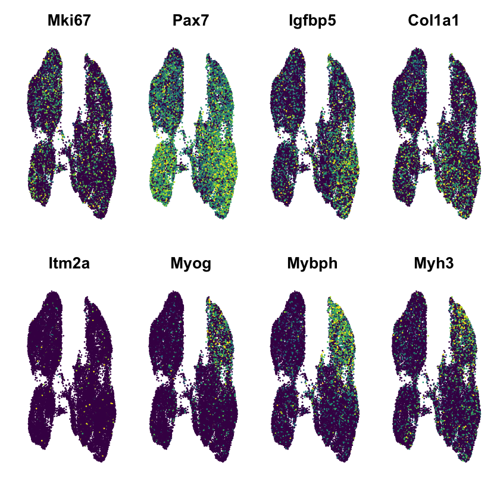
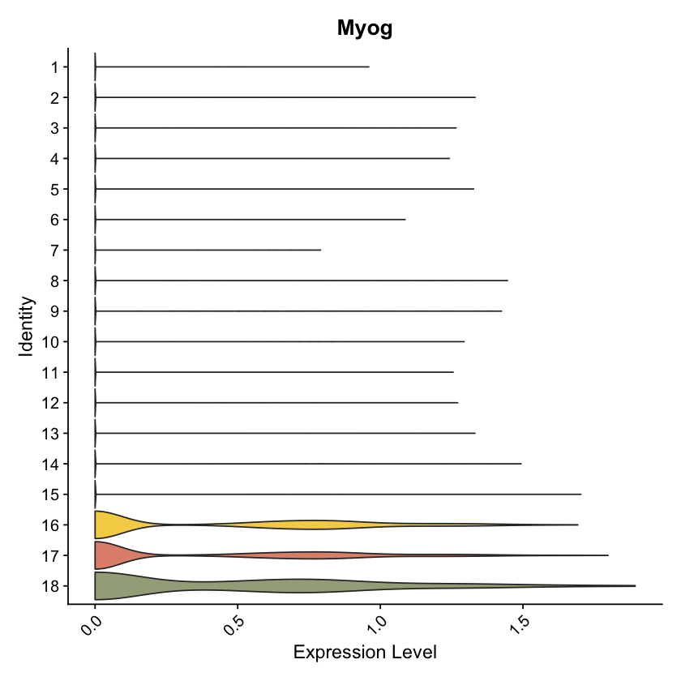
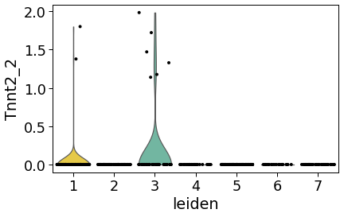

# Figure S4

#### For the TSS/TES calling in both single-cell and long-read
* Data was processed via the steps outlined in [figure 4](https://github.com/fairliereese/2021_c2c12/tree/master/figure_4)

## Figures made in R

```R
library(Signac)
library(Seurat)
library(rtracklayer)
library(GenomicRanges)
library(EnsDb.Mmusculus.v79)
library(viridis)
library(RColorBrewer)
library(ggplot2)
library(UpSetR)
library(reshape2)

source('../scripts/plotting.R')
```


```R
# filtered snATAC output from Signac
get_filt_tss_atac <- function() {
    load('../processing/ends/mb_mt_atac_tss_10pct_filt.rda')
    obj = mb_mt_atac_tss
    return(obj)
}

# bulk TESs
get_bulk_tes_beds <- function() {
    bulk_tes_80 = read.delim('../processing/ends/bulk_tes_80_combo_gencode_polyA.bed', stringsAsFactors = F, header = F)
    bulk_tes_80_ends = read.delim('../processing/ends/bulk_tes_80.sort.bed', stringsAsFactors = F, header = F)
    return(list(bulk_tes_80, bulk_tes_80_ends))
}

# sc TESs
get_sc_tes_beds <- function() {
    sc_tes_80 = read.delim('../processing/ends/sc_tes_80_combo_gencode_polyA.bed', stringsAsFactors = F, header = F)
    sc_tes_80_ends = read.delim('../processing/ends/sc_tes_80.sort.bed', stringsAsFactors = F, header = F)
    return(list(sc_tes_80, sc_tes_80_ends))
}

# bed files for TSSs 
get_tss_beds <- function() {
    bulk_tss_5 = read.delim('../processing/ends/bulk_tss_5_combo_gencode_prmenhP_cage_snatac18.bed', stringsAsFactors = F, header = F)
    bulk_tss_5_ends = read.delim('../processing/ends/bulk_tss_5.sort.bed', stringsAsFactors = F, header = F)
    return(list(bulk_tss_5, bulk_tss_5_ends))
}

# get TSS + read annot for long-Split-seq data
get_tss_annot <- function() {
    tss_annot = as.data.frame(read.delim('../processing/ends/sc_tss_10.sort.bed', header = F))
    return(tss_annot)
}
```

### Panel S4A


```R
tss_annot = get_tss_annot()
tss_annot$n_reads = as.numeric(sapply(strsplit(sapply(strsplit(as.character(tss_annot$V4), "ccs_"), "[[", 2), "_"), "[[", 2))

fname = "figures/histogram.pdf"
pdf(file = fname,
    width = 8,
    height = 8)
p = ggplot(tss_annot, aes(x=log2(n_reads)))  + 
  geom_histogram(colour="black", fill="#74C4ED",binwidth=0.3)+theme_bw()+
  theme(legend.position = "none",axis.text=element_text(size=12),
        axis.title=element_text(size=14)) +xlab("Log2(Number of reads per Split-seq TSS)")+ylab("Number of TSSs")
p
dev.off()
p
```

   


    

### Panel S4C


```R
objs = get_tss_beds()
bulk_tss_5 = objs[[1]]
bulk_tss_5_ends = objs[[2]]

colnames(bulk_tss_5) = c("end_chr","end_start","ends_stop","end_readID",
                        "end_score","end_strand","combo_chr","combo_start",
                        "combo_stop","combo_name","combo_score","combo_strand")
colnames(bulk_tss_5_ends) = c("end_chr","end_start","ends_stop","end_readID",
                   "end_score","end_strand")

bulk_tss_5$end_id_nreads = sapply(strsplit(as.character(bulk_tss_5$end_readID), "ccs_"), "[[", 2)
bulk_tss_5_ends$end_id_nreads = sapply(strsplit(as.character(bulk_tss_5_ends$end_readID), "ccs_"), "[[", 2)

tss_missing = bulk_tss_5_ends$end_id_nreads[which((bulk_tss_5_ends$end_id_nreads %in% bulk_tss_5$end_id_nreads) == FALSE)]
tss_missing = as.data.frame(tss_missing)
tss_missing$cage_mm10 = rep(0, length(tss_missing))
tss_missing$enhP = rep(0, dim(tss_missing)[1])
tss_missing$gencode_TSS = rep(0, dim(tss_missing)[1])
tss_missing$prom = rep(0, dim(tss_missing)[1])
tss_missing$snATAC = rep(0, dim(tss_missing)[1])

bulk_tss_5_smol = bulk_tss_5[,c("end_id_nreads","combo_name")]
bulk_tss_5_table = dcast(bulk_tss_5_smol,end_id_nreads~combo_name,fun.aggregate = function(x){as.integer(length(x) > 0)})
colnames(tss_missing) = colnames(bulk_tss_5_table)
bulk_tss_5_table = rbind(bulk_tss_5_table, tss_missing)
bulk_tss_5_table$TSS = rep(1,dim(bulk_tss_5_table)[1])

fname = "figures/bulk_tss_5pct_upset.pdf"
pdf(file = fname,
    width = 10,
    height = 4)
p = upset(
  bulk_tss_5_table,
  nsets = 7,
  nintersects = NA,
  order.by = "freq",
  line.size = 1.2,
  point.size = 3.5,
  text.scale = 1.5,
  mb.ratio = c(0.5, 0.5),
  main.bar.color = "#56B4E9",
  matrix.color="#56B4E9"
)
p
dev.off()
p
```

 

    


### Panel S4E


```R
obj = get_bulk_tes_beds()
bulk_tes_80 = obj[[1]]
bulk_tes_80_ends = obj[[2]]

colnames(bulk_tes_80) = c("end_chr","end_start","ends_stop","end_readID",
                         "end_score","end_strand","combo_chr","combo_start",
                         "combo_stop","combo_name","combo_score","combo_strand")
colnames(bulk_tes_80_ends) = c("end_chr","end_start","ends_stop","end_readID",
                              "end_score","end_strand")

bulk_tes_80$end_id_nreads = sapply(strsplit(as.character(bulk_tes_80$end_readID), "ccs_"), "[[", 2)
bulk_tes_80_ends$end_id_nreads = sapply(strsplit(as.character(bulk_tes_80_ends$end_readID), "ccs_"), "[[", 2)

tss_missing = bulk_tes_80_ends$end_id_nreads[which((bulk_tes_80_ends$end_id_nreads %in% bulk_tes_80$end_id_nreads) == FALSE)]
tss_missing = as.data.frame(tss_missing)
tss_missing$gencode_TES = rep(0, length(tss_missing))
tss_missing$polyA = rep(0, dim(tss_missing)[1])

bulk_tes_80_smol = bulk_tes_80[,c("end_id_nreads","combo_name")]
bulk_tes_80_table = dcast(bulk_tes_80_smol,end_id_nreads~combo_name,fun.aggregate = function(x){as.integer(length(x) > 0)})
colnames(tss_missing) = colnames(bulk_tes_80_table)
bulk_tes_80_table = rbind(bulk_tes_80_table, tss_missing)
bulk_tes_80_table$TSS = rep(1,dim(bulk_tes_80_table)[1])

fname = "figures/bulk_tes_80pct_upset.pdf"
pdf(file = fname,
    width = 4.5,
    height = 4)
p = upset(
  bulk_tes_80_table,
  nsets = 7,
  nintersects = NA,
  order.by = "freq",
  line.size = 1.2,
  point.size = 3.5,
  text.scale = 1.5,
  mb.ratio = c(0.5, 0.5),
  main.bar.color = "#E69F00",
  matrix.color="#E69F00"
)
p
dev.off()
p
```

    

    


### Panel S4G


```R
obj = get_sc_tes_beds()
sc_tes_80 = obj[[1]]
sc_tes_80_ends = obj[[2]]

colnames(sc_tes_80) = c("end_chr","end_start","ends_stop","end_readID",
                          "end_score","end_strand","combo_chr","combo_start",
                          "combo_stop","combo_name","combo_score","combo_strand")
colnames(sc_tes_80_ends) = c("end_chr","end_start","ends_stop","end_readID",
                               "end_score","end_strand")

sc_tes_80$end_id_nreads = sapply(strsplit(as.character(sc_tes_80$end_readID), "ccs_"), "[[", 2)
sc_tes_80_ends$end_id_nreads = sapply(strsplit(as.character(sc_tes_80_ends$end_readID), "ccs_"), "[[", 2)

tss_missing = sc_tes_80_ends$end_id_nreads[which((sc_tes_80_ends$end_id_nreads %in% sc_tes_80$end_id_nreads) == FALSE)]
tss_missing = as.data.frame(tss_missing)
tss_missing$gencode_TES = rep(0, length(tss_missing))
tss_missing$polyA = rep(0, dim(tss_missing)[1])

sc_tes_80_smol = sc_tes_80[,c("end_id_nreads","combo_name")]
sc_tes_80_table = dcast(sc_tes_80_smol,end_id_nreads~combo_name,fun.aggregate = function(x){as.integer(length(x) > 0)})
colnames(tss_missing) = colnames(sc_tes_80_table)
sc_tes_80_table = rbind(sc_tes_80_table, tss_missing)
sc_tes_80_table$TSS = rep(1,dim(sc_tes_80_table)[1])

fname = "figures/sc_tes_80pct_upset.pdf"
pdf(file = fname,
    width = 4.5,
    height = 4)
p = upset(
  sc_tes_80_table,
  nsets = 7,
  nintersects = NA,
  order.by = "freq",
  line.size = 1.2,
  point.size = 3.5,
  text.scale = 1.5,
  mb.ratio = c(0.5, 0.5),
  main.bar.color = "#E69F00",
  matrix.color="#E69F00"
)
p
dev.off()
p
```
    

    


### Panel S4I


```R
mb_mt_atac_tss = get_filt_tss_atac()

DefaultAssay(mb_mt_atac_tss) <- 'TSS'

tsss = c("chr1-135848863-135848863", #1
         "chr1-135844786-135844983", #2
         "chr1-135845345-135845602", #3
         "chr1-135836334-135836427") #4

fname = "figures/snatac_tnnt2_umaps.pdf"
pdf(file = fname,
    width = 9.6,
    height = 2.5)
p = FeaturePlot(
  object = mb_mt_atac_tss,
  features = tsss,
  pt.size = 0.1,label = F,
  max.cutoff = 'q95',
  order=T, ncol = 2
)  & NoAxes() & scale_colour_gradientn(colours = magma(21)) #& NoLegend() 
p
dev.off()
p
```


    


## Figures made in Python

```python
import pandas as pd
import sys
import os
import scanpy as sc
import seaborn as sns

p = os.path.dirname(os.getcwd())
sys.path.append(p)

from scripts.utils import *
from scripts.plotting import *
```

```python
# read in the data relevant for this figure
def get_sc_data():
    fname = '../processing/talon/sc_talon_read_annot.tsv'
    df = pd.read_csv(fname, sep='\t')    
    return df

def get_sc_tes_bed():
    
    fname = '../processing/ends/sc_tes.bed'
    df = pd.read_csv(fname, sep='\t', header=None, usecols=[3,9])
    df.columns = ['peak_id', 'read_name']
    
    return df

def get_bulk_data():
    fname = '../processing/talon/bulk_talon_read_annot.tsv'
    df = pd.read_csv(fname, sep='\t')    
    return df

def get_bulk_tss_bed():
    
    fname = '../processing/ends/bulk_tss.bed'
    df = pd.read_csv(fname, sep='\t', header=None, usecols=[3,9])
    df.columns = ['peak_id', 'read_name']
    return df

def get_bulk_tes_bed():
    
    fname = '../processing/ends/bulk_tes.bed'
    df = pd.read_csv(fname, sep='\t', header=None, usecols=[3,9])
    df.columns = ['peak_id', 'read_name']
    return df

def get_tss_adata():
    fname = '../processing/scanpy/sc_tss.h5ad'
    adata = sc.read(fname)
    
    return adata
```

### Panel S4B


```python
df = get_bulk_data()
tss = get_bulk_tss_bed()

ylim = 13
xlim = 15

opref = 'figures/bulk_tss'

plot_ends_iso(df, tss, opref, kind='tss', xlim=xlim, ylim=ylim)
```


    

    


### Panel S4D


```python
df = get_bulk_data()
tes = get_bulk_tes_bed()

ylim = 13
xlim = 15

opref = 'figures/bulk_tes'

plot_ends_iso(df, tes, opref, kind='tes', xlim=xlim, ylim=ylim)
```


    

    


### Panel S4E


```python
df = get_sc_data()
tes = get_sc_tes_bed()

ylim = 11
xlim = 5

opref = 'figures/sc_tss'

plot_ends_iso_cell(df, tes, opref, kind='tes', xlim=xlim, ylim=ylim)
```


    

    


### Panel S4H


```python
adata = get_tss_adata()
opref = 'figures/tss'
sns.set_context('paper', font_scale=2)

tsss = adata.var.loc[adata.var.gene_name == 'Tnnt2'].index.unique().tolist()
for tss in tsss:
    sc.pl.umap(adata, color=tss, frameon=False, size=120, return_fig=True, color_map='magma')
    ofig = '{}_{}_umap.pdf'.format(opref, tss)
    plt.savefig(ofig, dpi=300, bbox_inches='tight')  
```
   

    


    

    


    

    


    

    


### Panel S4J


```python
for tss in tsss:
    sc.pl.violin(adata, tss, groupby='leiden', jitter=0.4,
        size = 4, show = False)
    ofig = '{}_{}_leiden_violin.pdf'.format(opref, tss)
    plt.savefig(ofig, dpi=300, bbox_inches='tight')
```


    

    


    

    


    

    


    

    
